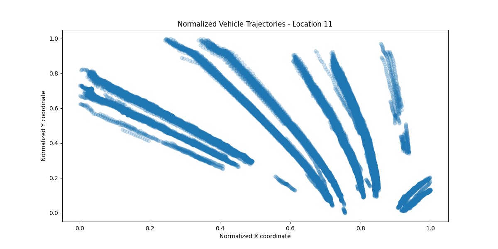
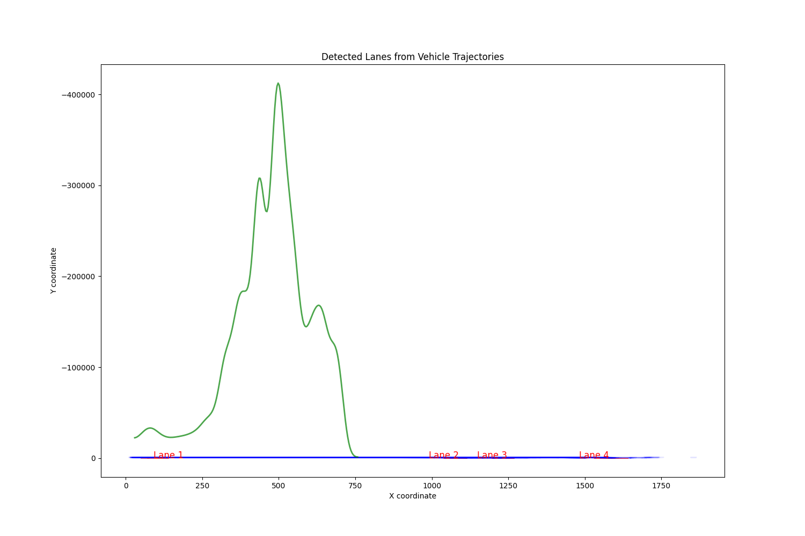
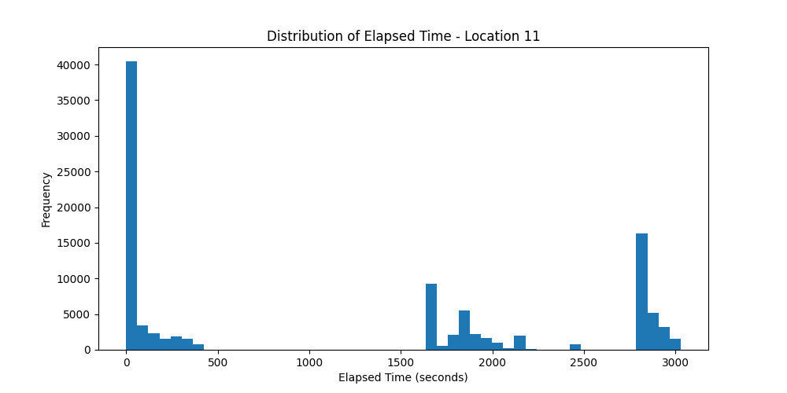
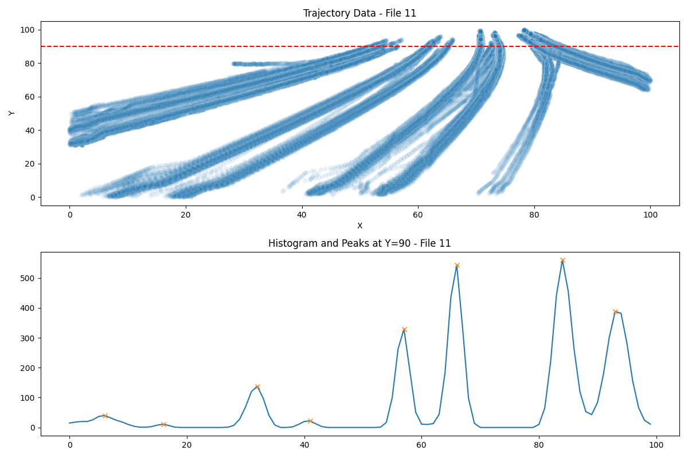

<p align="center">
  <a href="README.md">English</a> | <a href="README.ko.md">한국어</a>
</p>

<h1 align="center">Vehicle Trajectory Anomaly Detection</h1>

<p align="center">도로 CCTV 영상에서 차량 이상궤적을 식별하는 방법론 진화 연구 (LSTM-AE → 차로 상대 규칙 점수, F1 0.25 → 0.85)</p>

<p align="center">
  
  
  
  
</p>

CCTV 영상에서 차량 궤적을 추출하고, LSTM 오토인코더(LSTM Autoencoder)로 정상 궤적 패턴을 학습하여 **이상궤적(비정상 주행 패턴)을 식별**하는 석사학위논문 연구 코드입니다.

## 연구 개요

- 전국 40개 지점(지점 11~50)의 도로 CCTV 영상에서 YOLOv8 기반 객체 탐지·추적으로 차량 궤적 데이터를 수집
- 차량 궤적의 횡방향 밀도 히스토그램 피크 분석으로 도로 정보(차로 수, 차선 위치, 곡률)를 추출 (DeepLabV3/CLRNet 기반 영상 차선 검출도 병행 실험)
- 지점별 도로 특성(차선 수, 평균속도, 통행량)을 클러스터링(K-means, DBSCAN, GMM, 계층적 군집)하여 유사 지점을 그룹화
- 정상 궤적 시퀀스로 LSTM 오토인코더를 학습하고, 재구성 오차(reconstruction error) 기반으로 이상궤적을 식별
- 클러스터별 모델과 전체 통합 모델의 이상궤적 식별 정확도를 비교하여 정확도 향상을 검증

## 파이프라인

```
CCTV 영상 (지점 11~50)
   │
   ▼
[1] 궤적 추출 ──── YOLOv8 + 객체 추적 → TrackID별 (X, Y, Time) CSV
   │
   ▼
[2] 차선 검출 ──── 차로 수·도로 곡률 추정 → 도로 정보 CSV
   │
   ▼
[3] 데이터 전처리 ─ 짧은 궤적 제거, 상대좌표/속도 변환, 시퀀스 생성(길이 50)
   │
   ▼
[4] 지점 클러스터링 ─ K-means / DBSCAN / GMM / 계층적 군집 비교
   │
   ▼
[5] LSTM 오토인코더 ─ 정상 궤적 학습 → 재구성 오차로 이상궤적 판별
   │
   ▼
[6] 평가 ────────── 이상궤적 테스트 데이터 생성, 모델별 정확도 비교
```

## 디렉터리 구성

| 디렉터리 | 내용 |
|---|---|
| `1_trajectory_extraction/` | YOLOv8 기반 차량 탐지·추적 및 궤적 CSV 생성, 궤적 시각화 검증 |
| `2_lane_detection/` | 차선 검출, 차로 수 카운트, 도로 곡률 추정, 차선 라벨링 도구 |
| `3_preprocessing/` | 궤적 데이터 전처리(시퀀스화, 좌표 변환), 도로 정보 결합 |
| `4_clustering/` | 지점별 도로 특성 클러스터링 (K-means, DBSCAN, GMM, 계층적) 및 클러스터별 모델 생성 |
| `5_lstm_autoencoder/` | LSTM 오토인코더 모델 정의·학습 (모듈화 버전 + 통합 학습 스크립트) |
| `6_evaluation/` | 이상궤적 테스트 데이터 생성기(pygame), 정확도 비교, 평균속도·차량수 검증 |
| `docs/images/` | 결과 예시 이미지 |

## 주요 코드

### 1. 궤적 추출 (`1_trajectory_extraction/`)
- `trajectory_yolo8.py` — YOLOv8(car/bus/truck 클래스)로 다중 영상을 멀티프로세싱 처리, TrackID별 중심좌표 시계열을 CSV로 저장
- `track_validation.py` — 추출된 궤적 CSV를 시각화하여 추적 품질 검증

### 2. 차선 검출 (`2_lane_detection/`)
- `lane_detection.py`, `lane_count.py` — 차량 궤적의 X좌표 히스토그램을 가우시안 스무딩 후 피크 검출(`find_peaks`)하여 차선 수·차선 위치 추정
- `curve_estimator.py` — 도로 곡률 추정
- `line_labelling.py` — 차선 수동 라벨링 도구

### 3. 전처리 (`3_preprocessing/`)
- `preprocess.py` — 짧은 궤적 제거, 상대좌표/속도 기반 변환, 고정 길이 시퀀스 생성
- `trajectory_preprocessing.py`, `road_info.py` — 지점별 궤적 통합 및 도로 정보 결합

### 4. 클러스터링 (`4_clustering/`)
- 지점별 특성(차선 수, 평균속도, 통행량)으로 유사 지점 그룹화
- 실루엣 계수 등으로 K-means / DBSCAN / GMM / 계층적 군집 비교
- `kmeans_model.py`, `gmm_model.py` — 클러스터별 LSTM 오토인코더 모델 생성

### 5. LSTM 오토인코더 (`5_lstm_autoencoder/`)
- `model.py` — LSTM Encoder → Bottleneck(Dense) → RepeatVector → LSTM Decoder 구조 (TensorFlow/Keras)
- `dataset.py` — 속도·가속도 특징 생성, MinMax 정규화, 시퀀스 패딩
- `train_full_model.py` — 전체 지점 통합 모델 학습 (시퀀스 길이 50, 슬라이딩 윈도우)

### 6. 평가 (`6_evaluation/`)
- `anomaly_trajectory_generator.py` — 영상 위에 이상궤적을 직접 그려 테스트 데이터를 생성하는 pygame 도구
- `make_test_data.py` — 이상궤적 TrackID 필터링으로 테스트셋 구성
- `accuracy_comparison.py` — 추정 결과의 정확도(MAE, RMSE, ±1 일치율) 비교

## 실행 검증 및 방법론 개선

전 단계 코드를 실제 데이터로 실행 검증하고(YOLOv8 추적, 히스토그램 차선 추정, LSTM
오토인코더 학습·이상궤적 식별), 방법론을 단계적으로 개선한 실험 기록입니다.

- **상세 결과·그림:** [docs/ANALYSIS.md](docs/ANALYSIS.md)
- **진행 현황·향후 계획:** [docs/ROADMAP.md](docs/ROADMAP.md)
- **연구 여정 (이야기로 읽기):** [docs/JOURNEY.md](docs/JOURNEY.md)

### 개선 실험 요약

합성 이상 평가셋(역주행·차로횡단·급정거·지그재그) 기준, 논문 원방법(LSTM-AE 재구성
오차) 대비 **F1 0.25 → 0.85** (확대 평가셋·실험 ⑩ 기준)로 향상:

| # | 실험 | 판정 |
|---|---|---|
| ① | 지점별 정규화 (스케일 편향 해소) | ✅ |
| ② | 지점별 임계값 분리 | ✅ |
| ③ | 합성 이상 평가셋 (정량 평가 확립) | ✅ |
| ④ | 차로 상대 특징 + 2D 방향장 (F1 0.25→0.67, 역주행 89%) | ✅ |
| ⑥ | 입력 품질 개선 (스무딩만 순개선) | ⚠️ 부분 채택 |
| ⑦ | 하단 중앙점 재추출 + 짝비교 재검증 → **채택 구성(A2) 확립** | ✅ |
| ⑧ | 위성사진 대응점 실측 호모그래피 (미터 물리량 확보) | ⚠️ 물리량만 채택 |
| ⑩ | 차로횡단 특징 cross_flow (방향장 수직 변위 누적, 차로횡단 11→47%) | ✅ 채택 |
| ⑪ | 하이브리드 스코어: 규칙+LSTM-AE (상보 결합 — AE가 지그재그 회수, F1 0.81→0.85) | ✅ 채택 (F1 0.85) |

**채택 구성 (A2+D3+하이브리드):** 이미지 좌표 + 하단 중앙점(bottom-center) +
Savitzky-Golay 스무딩 + 직선 차선 모델 + 6특징 규칙 점수(역주행 정렬도·오프셋·
cross_flow·osc 등) + LSTM-AE 재구성 오차의 지점별 z-정규화 mean 결합
— 확대 평가셋 기준 **F1 0.85 / PR-AUC 0.97**.

### 성능 진화

| 방법 | F1 | 비고 |
|---|---|---|
| LSTM-AE 재구성 오차 (논문 원방법) | 0.25 | 행동 이상 대부분 미탐지 |
| + 차로 상대 특징 + 2D 방향장 (④) | 0.67 | 규칙 기반 점수로 전환 |
| + 궤적 스무딩 (⑥) | 0.69 | |
| + 하단 중앙점 재추출 (⑦) | 0.70 | 채택 구성 A2 확립 |
| + cross_flow·osc 특징 (⑩) | 0.81 | 차로횡단 11→47% |
| + LSTM-AE 하이브리드 mean (⑪) | **0.85** | AE가 지그재그 보완 (40→70%) |

유형별 탐지율(최종 구성): **역주행 100% · 급정거 89% · 지그재그 70% · 차로횡단 46%**

### 핵심 결과 그림

방향장 기반 규칙 점수가 LSTM-AE 재구성 오차를 크게 앞선 전환점 (실험 ④):


최대 병목이던 차로횡단을 해결한 cross_flow 특징 — 2D 방향장에 수직인 변위 성분만
누적해 곡률 교란 없이 "몇 차로를 건넜는가"를 측정 (실험 ⑩, 차로횡단 11→47%):


### 핵심 교훈

1. **좌표계 편향부터 의심하라** — 통합 모델의 이상 판정 37건이 전부 한 지점에 쏠려 있었다. 모델은 운전 행동이 아니라 카메라 해상도를 "이상"으로 배우고 있었다 (①②).
2. **그럴듯한 시각화는 증거가 아니다** — 라벨 기반 정량 평가를 도입하자 F1 0.25가 드러났다. 이후 모든 개선은 이 평가셋 위에서 판정 (③).
3. **도메인 지식은 특징·규칙으로 직접 쓰는 게 빠르다 — 다만 AE는 보완재로 값을 한다** — 규칙이 역주행·차로횡단을 주도하고, AE 재구성 오차가 규칙이 놓친 고주파 사행(지그재그)을 회수. 두 z-score의 mean 결합으로 F1 0.81→0.85 (④⑪).
4. **기하 보정은 잡음도 함께 확대한다** — 자동·실측 원근 보정 모두 탐지에는 순손실. 이미지 좌표의 원근 압축이 오히려 암묵적 정규화 역할 (⑤~⑨). 실측 호모그래피의 가치는 물리량(속도 km/h, 오프셋 m) 확보에 한정 (⑧).
5. **평가셋 크기가 판정을 좌우한다** — 지점·유형당 6개(양자 17%p)에서 보인 "개선"이 24개 확대셋에서 미재현되어 정정. 유형별 주장은 확대셋으로 재검이 필수 (⑨).
6. **접히는(fold) 특징을 의심하라** — "최근접 차선까지 거리"는 여러 차로를 건너면 신호가 접혀 사라진다. 방향장 기준으로 특징을 재정의하자 해결 (⑩).

관련 스크립트는 [`6_evaluation/`](6_evaluation/)의 `synthetic_anomaly_eval.py`,
`lane_relative_rule_eval.py`, `homography_rectification_eval.py`, `input_quality_eval.py`,
`bottom_center_eval.py`, `measured_homography_eval.py`, `curved_centerline_eval.py`,
`lane_cross_features_eval.py`, `hybrid_score_eval.py`.
위성사진 대응점 수작업 데이터는 [`6_evaluation/homography_gt/`](6_evaluation/homography_gt/),
대응점 지정 도구 생성기는 `make_correspondence_tool.py`, 하단 중앙점 재추출은
`1_trajectory_extraction/trajectory_yolo8_bottomcenter.py`.

## 결과 예시

| 차량 궤적 추출 | 차선 검출 |
|---|---|
|  |  |

| 통행 시간 분포 | 궤적 시각화 |
|---|---|
|  |  |

## 실행 환경

```bash
pip install -r requirements.txt
```

- Python 3.9+
- 주요 라이브러리: ultralytics(YOLOv8), OpenCV, TensorFlow/Keras, scikit-learn, pandas

> **참고:** CCTV 원본 영상, 궤적 CSV 원본 데이터, 학습된 모델 가중치(`.pt`, `.pth`)는 용량 및 데이터 제공 조건상 저장소에 포함하지 않았습니다. 스크립트 내 데이터 경로는 로컬 환경에 맞게 수정이 필요합니다.

## 논문 정보

- **제목:** LSTM 오토인코더를 활용한 차량이상궤적식별 정확도 향상에 관한 연구
- **저자:** 윤채민 (석사학위논문)
