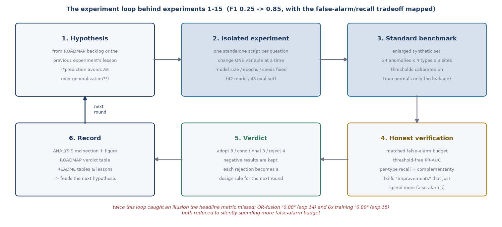
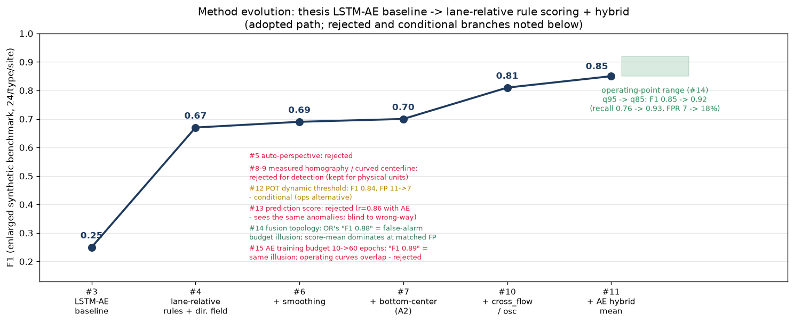
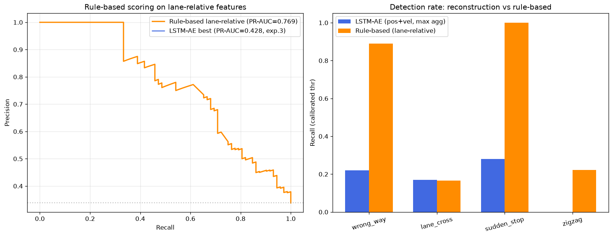
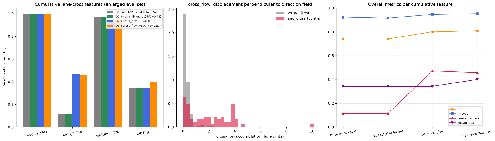
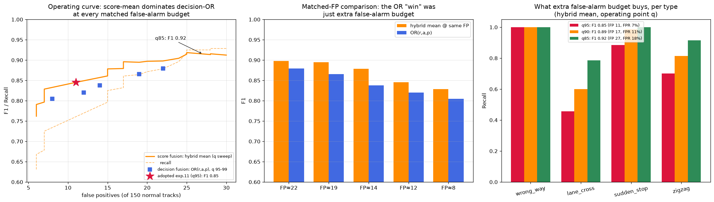
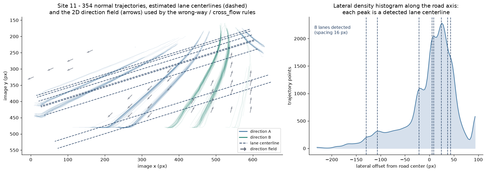
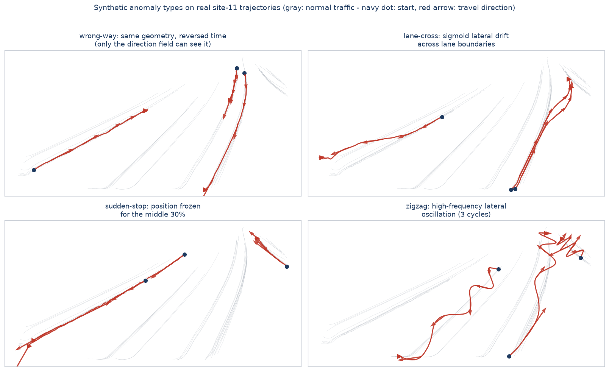
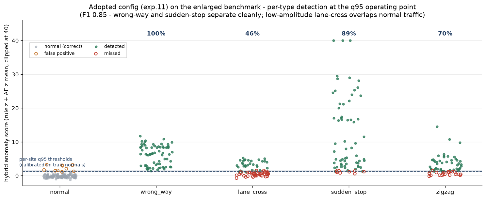

<p align="center">
  <a href="README.md">English</a> | <a href="README.ko.md">한국어</a>
</p>

<h1 align="center">Vehicle Trajectory Anomaly Detection</h1>

<p align="center">A method evolution study for detecting abnormal vehicle trajectories from road CCTV footage (LSTM-AE → lane-relative rule scoring, F1 0.25 → 0.85)</p>

<p align="center">
  
  
  
  
</p>

This repository contains the code of a master's thesis that extracts vehicle trajectories from road CCTV footage and identifies **abnormal trajectories (unusual driving patterns)** by learning normal patterns with an LSTM autoencoder — followed by a fifteen-experiment methodology study that evolved the pipeline into a lane-relative rule-scoring system.

## Overview

- Vehicle trajectories are collected from road CCTV at 40 nationwide locations (sites 11–50) using YOLOv8 detection and tracking
- Road information (lane count, lane positions, curvature) is estimated from the lateral density histogram of vehicle trajectories (image-based lane detection with DeepLabV3/CLRNet was also explored)
- Locations are clustered by road characteristics (lane count, average speed, traffic volume) using K-means, DBSCAN, GMM, and hierarchical clustering
- An LSTM autoencoder learns normal trajectory sequences and flags anomalies by reconstruction error
- Cluster-specific models are compared against a single unified model to verify the accuracy gain

## Pipeline

```
CCTV footage (sites 11–50)
   │
   ▼
[1] Trajectory extraction ── YOLOv8 + tracking → per-TrackID (X, Y, Time) CSV
   │
   ▼
[2] Lane detection ───────── lane count / road curvature → road-info CSV
   │
   ▼
[3] Preprocessing ────────── drop short tracks, relative coords, sequences (len 50)
   │
   ▼
[4] Location clustering ──── K-means / DBSCAN / GMM / hierarchical
   │
   ▼
[5] LSTM autoencoder ─────── learn normal patterns → reconstruction-error anomaly score
   │
   ▼
[6] Evaluation ───────────── synthetic anomaly test sets, per-method accuracy
```

## Directory layout

| Directory | Contents |
|---|---|
| `1_trajectory_extraction/` | YOLOv8 vehicle detection/tracking, trajectory CSV generation and validation |
| `2_lane_detection/` | Lane detection, lane counting, curvature estimation, labeling tools |
| `3_preprocessing/` | Trajectory preprocessing (sequencing, coordinate transforms), road-info joins |
| `4_clustering/` | Location clustering (K-means, DBSCAN, GMM, hierarchical) and per-cluster models |
| `5_lstm_autoencoder/` | LSTM autoencoder model definition and training |
| `6_evaluation/` | Synthetic anomaly generators, accuracy comparison, improvement experiments ①–⑮ |
| `docs/` | Analysis report, roadmap, research journey, result figures |

## Verification & methodology evolution

Every pipeline stage was re-run on real data, then improved through fifteen documented
experiments — including negative results and one retraction. Each experiment runs the
same six-stage loop; stage 4 (matched-false-alarm verification) exists because the
headline metric alone approved two "improvements" that were illusions:



- **Detailed results and figures:** [docs/ANALYSIS.md](docs/ANALYSIS.md) (Korean)
- **Status and future plans:** [docs/ROADMAP.md](docs/ROADMAP.md) (Korean)
- **The research journey, told as a story:** [docs/JOURNEY.md](docs/JOURNEY.md) (Korean)

### Experiment summary

On a synthetic anomaly benchmark (wrong-way, lane-cross, sudden-stop, zigzag),
the final configuration reaches **F1 0.25 → 0.85** versus the thesis baseline
(LSTM-AE reconstruction error), measured on the enlarged evaluation set:

| # | Experiment | Verdict |
|---|---|---|
| ① | Per-location normalization (removes scale bias) | ✅ |
| ② | Per-location thresholds | ✅ |
| ③ | Synthetic anomaly benchmark (quantitative evaluation) | ✅ |
| ④ | Lane-relative features + 2D direction field (F1 0.25→0.67) | ✅ |
| ⑥ | Input-quality stack (only smoothing helps) | ⚠️ partial |
| ⑦ | Bottom-center re-extraction → **adopted config A2** | ✅ |
| ⑧ | Measured homography from satellite correspondences (metric units) | ⚠️ physical units only |
| ⑩ | Lane-cross feature `cross_flow` (direction-field-perpendicular drift, 11→47%) | ✅ adopted |
| ⑪ | Hybrid score: rules + LSTM-AE (complementary — AE recovers zigzag, F1 0.81→0.85) | ✅ adopted (F1 0.85) |
| ⑫ | EVT/POT dynamic thresholds (GPD tail fit; threshold = f(false-alarm rate q), FP 11→7, 3–7× less anchor-sensitive) | ⚠️ conditional — ops/scale-out alternative |
| ⑬ | Prediction-based anomaly score (seq2seq): r=0.86 with AE — sees the same anomalies, blind to wrong-way (1%) | ❌ rejected — pick score sources by violated invariant |
| ⑭ | Fusion topology × operating point: OR-fusion's "F1 0.88" unmasked as false-alarm-budget illusion; operating curve recorded (q85: F1 0.92, FPR 18%) | ✅ methodology adopted (config unchanged) |
| ⑮ | AE training budget 10→60 epochs: apparent F1 0.85→0.89 is the same illusion — operating curves overlap, PR-AUC +0.006 | ❌ rejected — second proof of the matched-FP rule |

**Adopted configuration (A2+D3+hybrid):** image coordinates + bottom-center point +
Savitzky-Golay smoothing + straight lane model + 6-feature rule scoring
(wrong-way alignment, offset stats, `cross_flow`, `osc`) fused with LSTM-AE
reconstruction error (per-location z-normalized mean) —
**F1 0.85 / PR-AUC 0.97** on the enlarged evaluation set.

### Performance evolution

| Method | F1 | Note |
|---|---|---|
| LSTM-AE reconstruction error (thesis baseline) | 0.25 | misses most behavioral anomalies |
| + lane-relative features + 2D direction field (④) | 0.67 | switch to rule-based scoring |
| + trajectory smoothing (⑥) | 0.69 | |
| + bottom-center re-extraction (⑦) | 0.70 | adopted config A2 |
| + cross_flow / osc features (⑩) | 0.81 | lane-cross 11→47% |
| + LSTM-AE hybrid mean (⑪) | **0.85** | AE complements zigzag (40→70%) |

Per-type detection (final config, q95): **wrong-way 100% · sudden-stop 89% · zigzag 70% · lane-cross 46%**

The q95 operating point (nominal 5% false-alarm rate) is a deployment choice, not the
score's ceiling: the same score reaches **F1 0.92 (recall 0.93, lane-cross 79%,
zigzag 91%) at q85 / FPR 18%** — roughly 1.5%p of recall per 1%p of false-alarm
budget (experiment ⑭'s operating curve).



### Key result figures

The turning point — direction-field rule scoring decisively beats LSTM-AE
reconstruction error (experiment ④):



The `cross_flow` feature that cracked the hardest anomaly type — accumulating only
the displacement component perpendicular to the 2D direction field measures "how
many lanes were crossed" immune to road curvature (experiment ⑩, lane-cross 11→47%):



Two "improvements" that beat F1 0.85 — OR-fusion (0.88) and a 6× larger AE training
budget (0.89) — both unmasked as the *same* illusion: they silently spend more
false-alarm budget, and at any matched budget the adopted configuration wins
(experiments ⑭⑮). Matched-FP comparison is now a standard step:



### Key lessons

1. **Suspect coordinate-frame bias before believing the model** — all 37 anomalies from the unified model landed at a single site; it had learned camera resolution, not driving behavior (①②).
2. **Plausible visualizations are not evidence** — labeled quantitative evaluation revealed F1 0.25; every later improvement is judged on that benchmark (③).
3. **Domain knowledge works faster as features and rules — but the autoencoder earns its keep as a complement** — rules dominate wrong-way and lane-cross while AE reconstruction error recovers oscillatory anomalies the rules miss; fusing the two z-scores lifts F1 0.81→0.85 (④⑪).
4. **Geometric rectification amplifies noise along with signal** — both automatic and measured perspective correction were net losses for detection; perspective compression in image coordinates acts as implicit normalization. Measured homography remains valuable for physical units (km/h, meters) (⑤–⑨).
5. **Evaluation-set size decides verdicts** — "improvements" seen with 6 anomalies per cell (17%p quantum) failed to replicate at 24 per cell and were retracted (⑨).
6. **Watch out for folding features** — distance-to-nearest-lane collapses to zero after a multi-lane cross; redefining the feature against the direction field fixed it (⑩).
7. **Never compare detectors without matching the false-alarm budget** — two unrelated "improvements" (OR-fusion F1 0.88, longer AE training F1 0.89) both reduced to silently looser thresholds; at matched FP the adopted config dominated both. Threshold-free metrics (PR-AUC) and operating curves are now part of every verdict (⑭⑮).
8. **Pick anomaly-score sources by the invariant they violate** — prediction error tracks physical smoothness, reconstruction error tracks pattern typicality, rules track lane conformance. The seq2seq predictor correlated 0.86 with AE (same anomalies) and was structurally blind to wrong-way driving (⑬).

Key scripts live in [`6_evaluation/`](6_evaluation/): `synthetic_anomaly_eval.py`,
`lane_relative_rule_eval.py`, `homography_rectification_eval.py`, `input_quality_eval.py`,
`bottom_center_eval.py`, `measured_homography_eval.py`, `curved_centerline_eval.py`,
`lane_cross_features_eval.py`, `hybrid_score_eval.py`, `evt_threshold_eval.py`,
`prediction_score_eval.py`, `fusion_operating_point_eval.py`,
`ae_training_budget_eval.py` (`method_evolution_figure.py` renders the summary
figure). Hand-labeled satellite correspondence points are in
[`6_evaluation/homography_gt/`](6_evaluation/homography_gt/); the annotation-tool
generator is `make_correspondence_tool.py`, and bottom-center re-extraction is
`1_trajectory_extraction/trajectory_yolo8_bottomcenter.py`.

## Result examples

All three figures are produced from real site-11 CCTV trajectories by
`6_evaluation/result_example_figures.py`.

**What the pipeline builds from raw trajectories** — 354 tracks, the lane
centerlines detected from their lateral density histogram (right panel: each
peak is a lane), and the 2D direction field that powers the wrong-way and
`cross_flow` rules:



**What it is asked to find** — the four synthetic anomaly types injected on
real tracks (arrows show travel direction; note the wrong-way track is
geometrically identical to normal traffic):



**How the decision is made** — every track's hybrid score (rule z + AE z mean)
against the per-site thresholds calibrated on training normals only. Wrong-way
and sudden-stop separate by an order of magnitude; the misses concentrate in
low-amplitude lane-cross and zigzag tracks that overlap normal traffic:



## Environment

```bash
pip install -r requirements.txt
```

- Python 3.9+
- Key libraries: ultralytics (YOLOv8), OpenCV, TensorFlow/Keras, scikit-learn, pandas

> **Note:** raw CCTV footage, trajectory CSVs, and trained weights (`.pt`, `.pth`) are
> not included due to size and data-sharing constraints. Data paths inside the scripts
> are hard-coded to the original environment and need local adjustment.

## Thesis

- **Title:** A Study on Improving the Accuracy of Vehicle Anomalous Trajectory Identification Using an LSTM Autoencoder
- **Author:** Chaemin Yoon (master's thesis)
