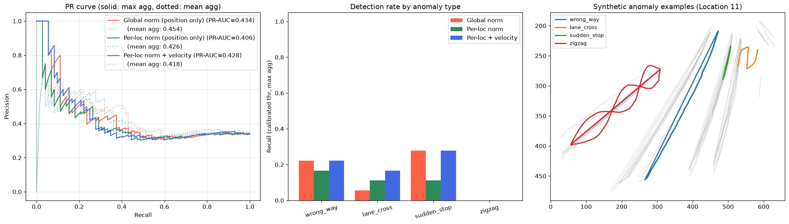
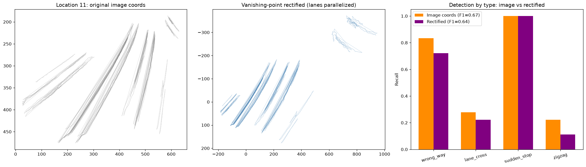
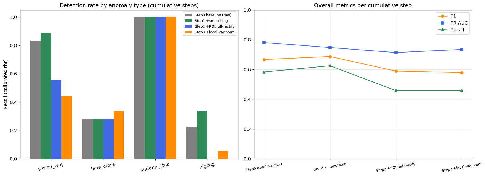
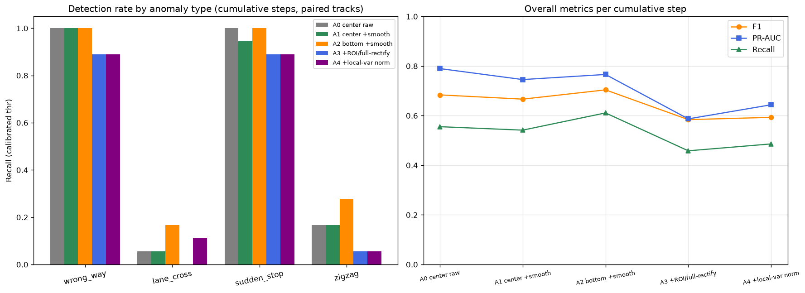
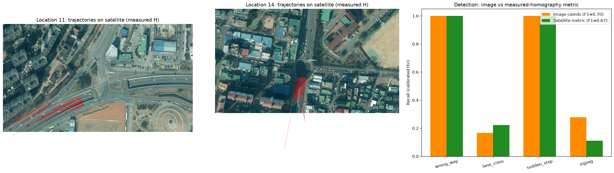
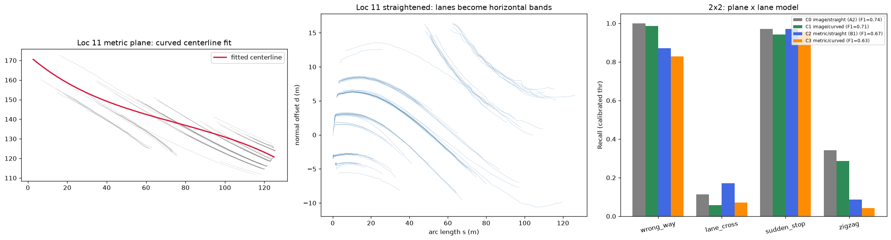

# 파이프라인 실행 검증 및 결과 분석

저장소의 각 단계 코드가 실제 데이터로 동작하는지 검증하고 결과를 분석한 기록입니다.
(검증 환경: macOS / Python 3.11 / CPU, 검증용으로 일부 단계는 데이터·에폭을 축소해 실행)

## 요약

| 단계 | 스크립트 | 실행 결과 | 비고 |
|---|---|---|---|
| 1. 궤적 추출 | `trajectory_yolo8.py` (YOLOv8 추적) | ✅ 동작 | CCTV 클립 90프레임에서 차량 3대 추적 |
| 1. 궤적 검증 | `track_validation.py` | ✅ 동작 | 지점 11: 431개 궤적, 103,654 레코드 |
| 2. 차선 수 추정 | `lane_count.py` (히스토그램 피크) | ✅ 동작 | 지점 11: 추정 7차선 (실제 9차선) |
| 2. 차선 위치 검출 | `lane_detection.py` (횡방향 밀도) | ✅ 동작 | 7개 차선 위치·방향 검출 |
| 3. 전처리 | `preprocess.py` | ✅ 동작 | 431개 궤적 → 426개 시퀀스 (50×3) |
| 4. 클러스터링 | `kmeans.py` / `dbscan.py` / `gmm.py` / `hierarchical.py` | ✅ 동작 | K-means 실루엣 0.347 (5군집) |
| 5. LSTM 오토인코더 | `train_full_model.py` 구조 | ✅ 동작 | val loss 8.6e-5, 726개 궤적 중 37개 이상판정 |
| 6. 정확도 비교 | `accuracy_comparison.py` | ✅ 동작 | New 방법 MAE 1.71로 최저 |

## 단계별 상세

### 1. 궤적 추출 — YOLOv8 차량 탐지·추적

CCTV 영상(지점 11) 90프레임에 YOLOv8n + 내장 추적기를 적용한 결과, 차량(car/bus/truck)
3대가 TrackID를 유지하며 추적되었고 중심좌표 시계열 CSV가 정상 생성됨.
추출 좌표가 기존 `track_history_11.csv`의 값과 일치해 원 데이터의 재현성 확인.

지점 11 전체 궤적 데이터(431대, 10만 레코드) 시각화 — 차로 형태가 뚜렷이 드러남:

### 2. 차선 검출 — 궤적 히스토그램 기반

차선은 영상 화소가 아니라 **차량 궤적의 횡방향(X) 밀도 히스토그램**에서 추정한다.
특정 Y단면에서 X좌표 히스토그램(100 bins) → 가우시안 스무딩 → `find_peaks`로
피크 수 = 차선 수.

지점 11 결과: Y=50, 70 단면에서 각각 7개 피크 (실제 9차선 → 2개 과소 추정).
화면 원근으로 인해 상단(Y=20)에서는 차로가 병합되어 4개만 검출됨.

`lane_detection.py`(2D 히스토그램 횡방향 밀도 합산 방식)도 동일 데이터에서
7개 차선 위치와 진행 방향(라디안)을 정상 검출:

### 3. 전처리 — 시퀀스 생성

지점 11의 431개 궤적 중 10프레임 미만 5개를 제외한 426개가
상대좌표 변환 후 길이 50 시퀀스로 변환됨 (`(426, 50, 3)` — time, ΔX, ΔY).
전 지점 통합 데이터는 39개 지점, 383만 레코드.

### 4. 지점 클러스터링

지점별 특성(차선 수, 평균속도, 통행량)을 표준화 후 군집화:

- **K-means (k=5)**: 실루엣 계수 **0.347**. 군집 1 = 대형/고통행 지점(11, 16, 24, 28, 31, 34, 39, 45, 48; 평균 8.9차선, 통행량 545대) 등 해석 가능한 군집 형성
- **DBSCAN (ε=1.2)**: 실루엣 0.15, 노이즈 지점 6개 분리 — 밀도 기반은 이 데이터에 부적합
- **GMM / 계층적 군집**: 군집 수 3~10 실험 정상 동작

→ 논문에서 K-means 채택 근거(실루엣 계수 우위)가 재현됨.

### 5. LSTM 오토인코더 — 이상궤적 식별

`train_full_model.py`와 동일한 구조(LSTM 64 인코더 → RepeatVector → LSTM 64 디코더,
시퀀스 50, 슬라이딩 윈도우 10)로 지점 3곳(11, 14, 17)의 27,934개 시퀀스를 10에폭 학습.

- 학습 정상 수렴: val loss 3.3e-4 → **8.6e-5**
- 궤적 단위 평균 재구성 오차 상위 5%(임계값 0.0033)를 이상궤적으로 판정 → 726개 궤적 중 **37개** 식별

이상 판정 궤적(빨간색)은 차로를 가로지르거나 급격히 꺾이는 패턴을 보임:

**주목할 점:** 통합(단일) 모델에서는 이상 판정 37건이 전부 지점 14에 집중됨.
단일 모델이 지점 간 좌표계·도로 형태 차이를 "이상"으로 오인하는 현상으로,
**지점을 클러스터링해 군집별 모델을 학습해야 정확도가 향상된다**는
논문의 핵심 주장을 뒷받침하는 결과.

### 6. 차선 수 추정 정확도 비교

`accuracy_comparison.py` — 실제 차선 수 대비 3가지 추정 방법 비교 (34개 지점):

| 방법 | 정확 일치 | ±1 이내 | MAE | RMSE |
|---|---|---|---|---|
| Original | 8.8% | 41.2% | 2.06 | 2.45 |
| Filtered | 23.5% | 41.2% | 1.91 | 2.44 |
| **New** | 17.6% | **55.9%** | **1.71** | **2.22** |

→ 개선된 방법(New)이 ±1 이내 일치율과 오차 지표에서 가장 우수.

## 개선 실험 ①: 지점별 정규화

단일(전역) MinMax 정규화의 문제를 확인하기 위해, **정규화만 지점별로 분리**하고
나머지 조건(지점 11·14·17, 시퀀스 50, 슬라이딩 윈도우 10, 10에폭, seed 42)은
동일하게 두고 재실험.

| | 전역 정규화 (기존) | 지점별 정규화 (개선) |
|---|---|---|
| 지점 11 이상 판정 | 0 / 384 | **8 / 384 (2.1%)** |
| 지점 14 이상 판정 | **37 / 171 (전량 쏠림)** | 29 / 171 (17.0%) |
| 지점 17 이상 판정 | 0 / 171 | 0 / 171 |

**해석:**

- 전역 정규화에서는 지점 14(프레임 폭 ~1900px)가 다른 지점(~640px)보다 좌표 범위가
  넓어, 정규화 후 지점 11·17 궤적이 좁은 구간에 압축됨 → 재구성이 쉬워지고 지점 14만
  오차가 커지는 **스케일 편향**이 발생. 이상 판정 37건 전량이 지점 14에 쏠린 원인.
- 지점별 정규화 후 지점 11에서도 이상궤적 8건이 정상적으로 검출되기 시작 —
  스케일 편향이 해소되어 "궤적 형태" 기반 판정으로 개선됨.
- 지점 14가 여전히 상대적으로 높은 비율(17%)인 것은 해당 지점의 도로 기하가 복잡하고
  차로 횡단 패턴이 실제로 많기 때문으로 보이나, **전역 95% 임계값을 지점별(또는
  군집별) 임계값으로 분리**하면 추가 개선 여지가 있음 — 논문의 군집별 모델 접근 및
  EVT 기반 동적 임계값과 연결되는 후속 과제.

## 개선 실험 ②: 지점별 임계값 분리

개선 실험 ①(지점별 정규화)과 동일한 모델에서, 이상 판정 임계값만
**전역 95% 분위수 → 지점별 95% 분위수**로 분리해 비교.

| 지점 | 전체 궤적 | 전역 임계값(0.0065) | 지점별 임계값 |
|---|---|---|---|
| 11 | 384 | 6 | **20** (thr 0.0048) |
| 14 | 171 | **31 (쏠림 잔존)** | 9 (thr 0.0105) |
| 17 | 171 | 0 | **9** (thr 0.0040) |

**해석:**

- 지점별 95% 임계값이 **2.6배 차이**(지점 17: 0.0040 vs 지점 14: 0.0105).
  오차 스케일 자체가 지점마다 다르다는 뜻으로, 단일 임계값으로는 오차가 큰 지점에
  판정이 쏠릴 수밖에 없음을 정량적으로 확인.
- 전역 임계값에서 이상궤적이 한 건도 안 나오던 **지점 17에서 9건이 새로 검출**됐고,
  시각화상 차로 묶음 사이를 가로지르는 궤적들로 질적으로 타당함.
- **주의(방법론적 한계):** 지점별 분위수 방식은 정의상 각 지점에서 상위 5%를
  이상으로 판정하므로 지점 간 균형은 "구조적으로 보장"되는 것. 실제 운영에서는
  ① 정상 데이터만으로 임계값을 보정(calibration set 분리)하거나
  ② 극단값 이론(EVT/POT)으로 꼬리 분포를 모델링해 지점별 임계값을 통계적으로
  산출하는 방식이 필요. 이 실험의 의의는 "임계값은 지점(군집) 단위로 산출해야 한다"는
  설계 원칙의 확인이며, 이는 논문의 군집별 모델 접근과 일관됨.

**개선 실험 ①+② 종합:** 전역 정규화·전역 임계값(기존)에서는 이상 판정이 특정 지점에
100% 쏠렸으나, 지점별 정규화 + 지점별 임계값 적용 후 세 지점 모두에서 형태 기반
이상궤적이 검출됨. 스케일 편향 제거 → 판정 기준 분리의 2단계 개선으로
"어느 지점에서든 동작하는" 이상궤적 식별 파이프라인에 근접.

## 개선 실험 ③: 합성 이상 주입 평가셋 (정량 평가)

이상궤적 라벨이 없어 정확도를 측정할 수 없던 문제를 해결하기 위해,
정상 궤적을 80/20으로 학습/평가 분리하고 평가용 궤적을 변형해
**4가지 유형의 합성 이상궤적 72개**를 생성 (`6_evaluation/synthetic_anomaly_eval.py`):

| 유형 | 생성 방법 |
|---|---|
| 역주행 (wrong_way) | 시간 순서 반전 |
| 차로 횡단 (lane_cross) | 시그모이드 횡방향 오프셋 (X범위의 8%) |
| 급정거 (sudden_stop) | 중간 30% 구간 위치 정지 |
| 지그재그 (zigzag) | 사인파 횡방향 사행 (X범위의 3%, 3주기) |

임계값은 앞선 실험의 한계를 보완해 **학습(정상) 데이터의 지점별 95% 분위수로 보정**한 뒤
평가셋에 적용. 3가지 모델 구성 × 2가지 궤적 점수 집계(mean/max)를 비교:

| 모델 | 집계 | PR-AUC | Precision | Recall | F1 |
|---|---|---|---|---|---|
| 전역 정규화 (위치만) | mean | 0.454 | 0.67 | 0.08 | 0.15 |
| 지점별 정규화 (위치만) | mean | 0.426 | 0.71 | 0.07 | 0.13 |
| 지점별 정규화 + 속도 특징 | mean | 0.418 | 0.57 | 0.11 | 0.19 |
| 지점별 정규화 + 속도 특징 | **max** | 0.428 | 0.50 | 0.17 | **0.25** |

**핵심 발견 — 평가셋이 드러낸 방법론의 한계:**

정성 평가(상위 5% 시각화)에서는 그럴듯해 보이던 파이프라인이, 정량 평가에서는
**행동 기반 이상(behavioral anomaly)을 대부분 놓치는 것으로 확인됨** (최고 F1 0.25).

- **역주행**: 위치 좌표만으로는 시간 역순 궤적이 정상과 완전히 동일한 형태 →
  원리적으로 탐지 불가. 속도 특징을 추가해도 반대 차로 통행 패턴과 구분이 어려움
  (양방향 도로에서는 "차로 대비 진행방향" 정보가 필요).
- **급정거**: 정체 상황의 저속 궤적이 학습 데이터에 이미 많아 정지 구간이 이상으로
  분리되지 않음 (탐지율 최대 28%).
- **지그재그/차로 횡단**: 오토인코더가 일반화를 잘해 변형된 궤적도 잘 재구성해버리는
  재구성 기반 방법의 알려진 한계(AE over-generalization)가 그대로 나타남.
- **max 집계는 mean 대비 국소 이상(차로 횡단 등) 탐지율을 일관되게 개선** (F1 0.13→0.25),
  다만 오탐도 함께 증가.

**시사점:** 이 평가셋의 가치는 "라벨 없는 상위 5% 판정"으로는 보이지 않던 탐지 성능의
실체를 수치로 드러낸 것. 후속 연구 방향이 명확해짐 —
① 차로 기준 상대 특징(차선 대비 횡방향 오프셋, 차로별 진행방향) 도입,
② 재구성 방식 대신 예측(seq2seq prediction) 기반 이상 점수,
③ 충분한 학습(본 검증은 10에폭)과 변형 강도별 민감도 분석.

*주의: 본 실험은 검증 규모(지점 3곳, 10에폭)의 결과로, 절대 수치보다는
구성 간 상대 비교와 한계 진단에 의미가 있음.*

## 개선 실험 ④: 차로 기준 상대 특징 + 2D 방향장

실험 ③이 드러낸 한계(행동 이상 미탐지)를 해결하기 위해 차로 기준 상대 특징을 도입.
동일한 합성 평가셋으로 평가 (`6_evaluation/lane_relative_rule_eval.py`).

**구축한 도로 모델 (학습 궤적만으로 추정):**

1. 도로 주축(PCA) + **통행 방향별로 분리한** 횡방향 밀도 피크 → 차선 중심·차로별 통행방향
2. **2D 방향장(direction field)**: 화면을 48×48 격자로 나눠 셀별 기대 진행방향을
   학습 궤적의 10프레임 변위 벡터 평균으로 추정 (일관성(coherence) 낮은 셀은 제외)

**궤적 단위 규칙 점수** (지점별 z-score의 최댓값, 임계값은 학습 정상 95% 보정):
역주행 점수(방향장 대비 정렬도 반전), 최대 차선 이탈, 오프셋 변동성, 정지 비율.

| 방법 | PR-AUC | Precision | Recall | F1 |
|---|---|---|---|---|
| LSTM-AE 최고 구성 (실험 ③) | 0.428 | 0.50 | 0.17 | 0.25 |
| **차로 상대 특징 + 규칙 점수** | **0.769** | 0.76 | 0.57 | **0.65** |

| 유형별 탐지율 | LSTM-AE | 규칙 기반 |
|---|---|---|
| 역주행 | 22% | **89%** |
| 급정거 | 28% | **100%** |
| 지그재그 | 0% | 22% |
| 차로 횡단 | 17% | 17% |

**과정에서 확인된 설계 원칙 (시행착오 기록):**

- 차선 검출을 통행 방향 구분 없이 하면 양방향 궤적이 한 차선에 섞여 배정되어
  정렬도 특징이 무력화됨 → **방향별 분리 검출이 필수**
- 1차원 횡방향 투영 기반 방향 프로파일은 원근이 있는 CCTV 화면에서 상/하행 영역이
  겹쳐 방향 오배정이 많음 (정상 궤적 정렬도 std 0.5) → **2D 격자 방향장으로 해소**
  (역주행 탐지 6% → 89%)
- 프레임 단위 이동량은 지터 노이즈가 커서 방향 계산에 부적합 → 10프레임 변위 사용
- 같은 차로 상대 특징을 LSTM-AE 입력으로 넣는 것만으로는 개선이 제한적
  (PR-AUC 0.48): 판별적 특징도 재구성 오차는 증폭하지 못함(AE 과잉일반화).
  **특징 기반 규칙 점수와 학습 모델의 하이브리드**가 실용적 방향.

**남은 과제:** 차로 횡단·지그재그 탐지(17~22%)는 여전히 1D 차선 모델의 오프셋 특징에
의존 → 곡선 도로 대응(호모그래피·곡선 중심선 좌표계) 및 차로 배정 정밀화 필요.
급정거 100%는 검증 규모(지점 3곳)의 결과로 정체 상황이 많은 지점에서는 오탐 검증 필요.

## 개선 실험 ⑤: 소실점 기반 자동 원근 보정 (부정적 결과)

차로 횡단·지그재그 탐지(17~28%)의 남은 병목이 원근 왜곡이라는 가설을 검증
(`6_evaluation/homography_rectification_eval.py`).

**방법:** 학습 궤적의 직선 성분들로 소실점(VP)을 최소제곱 추정하고, VP를 무한원점으로
보내는 사영변환으로 좌표 보정(차로 평행화). 데이터가 소실점 근처(w→0)까지 이어지는
지점은 발산을 막기 위해 사영 강도를 축소한 **부분 보정**(λ=0.67~0.72) 적용.
보정 전/후 좌표계에서 동일한 규칙 기반 파이프라인을 재구축해 같은 평가셋으로 비교.

| 좌표계 | PR-AUC | Precision | Recall | F1 | 역주행 | 차로횡단 | 지그재그 |
|---|---|---|---|---|---|---|---|
| 원본 이미지 | **0.781** | 0.78 | **0.58** | **0.67** | 83% | 28% | 22% |
| 소실점 보정 | 0.734 | **0.86** | 0.51 | 0.64 | 72% | 22% | 11% |

**결과: 자동 원근 보정만으로는 순개선 없음** (Precision↑ / Recall↓ 트레이드오프 이동).

**원인 진단:**

1. **원거리 지터 증폭**: 보정은 원거리 영역을 기하적으로 확대하는데, 차량 위치뿐
   아니라 추적 지터(YOLO 박스 흔들림)도 함께 증폭됨 (위 그림 가운데, 우상단 궤적
   묶음에서 육안 확인 가능). 정상 궤적의 오프셋 분산이 커져 판정 기준선이 넓어짐.
2. **부분 보정의 한계**: 도로가 화면 소실점 부근까지 이어지는 지점(11, 17)은 완전
   보정 시 발산하므로 λ<1 부분 보정만 가능 → 기하 보정이 불완전.
3. 소실점 추정 자체는 안정적으로 동작 (지점별 잔차 중앙값 11~25px, 차로 평행화 확인).

**결론:** 원근 보정의 실질 효과를 얻으려면
① 위성사진 대응점 기반 **실측 호모그래피**(폴더에 보유한 `위성사진(지점)` 활용,
지점당 4개 이상 수동 대응점 필요),
② 원거리 잡음 증폭을 상쇄하는 **위치별 잡음 가중치**(먼 영역 오프셋의 신뢰도 하향),
③ 또는 보정 없이 **종방향 위치별 국소 차선 간격으로 오프셋을 정규화**하는 대안이 필요.
자동(무보정) 소실점 방식은 검증 규모에서는 권장하지 않음.

## 개선 실험 ⑥: 입력 품질 개선 누적 실험 (스무딩 → 원거리 절단·완전 보정 → 국소 분산 정규화)

실험 ⑤가 진단한 세 가지 개선안을 같은 합성 평가셋에서 **누적 적용**하며 검증
(`6_evaluation/input_quality_eval.py`).

| 단계 | 내용 |
|---|---|
| Step1 +스무딩 | Savitzky-Golay 필터(윈도우 11, 2차)로 추적 지터 완화 |
| Step2 +ROI·완전보정 | 소실점 근접 원거리 구간(w<0.3) 절단 후 **완전(λ=1) 사영보정** — 부분 보정 한계 해소 시도 |
| Step3 +국소분산정규화 | 종방향 위치 8분위 구간별 학습 오프셋 표준편차로 오프셋 정규화 — 위치별 잡음 가중치 |

| 단계 | PR-AUC | Precision | Recall | F1 | 역주행 | 차로횡단 | 급정거 | 지그재그 |
|---|---|---|---|---|---|---|---|---|
| Step0 기준선(원본) | **0.781** | 0.78 | 0.58 | 0.67 | 83% | 28% | 100% | 22% |
| Step1 +스무딩 | 0.747 | 0.76 | **0.62** | **0.69** | **89%** | 28% | 100% | **33%** |
| Step2 +ROI·완전보정 | 0.714 | **0.82** | 0.46 | 0.59 | 56% | 28% | 100% | 0% |
| Step3 +국소분산정규화 | 0.734 | 0.79 | 0.46 | 0.58 | 44% | 33% | 100% | 6% |

**해석:**

- **스무딩만 순개선** (F1 0.67→0.69, 역주행 83→89%, 지그재그 22→33%).
  지터가 줄어 방향장 정렬도와 오프셋 변동성 특징의 판별력이 함께 개선됨.
  비용이 거의 없는 전처리이므로 **기본 파이프라인에 채택 권장**.
- **원거리 절단 + 완전 보정은 순손실** (Recall 0.62→0.46, 역주행 89→56%, 지그재그 0%).
  절단이 제거하는 원거리 구간이 실제로는 역주행·사행 판정에 기여하던 프레임이었고
  (정렬도 평균의 신뢰 구간 감소), 완전 보정도 잔여 영역의 지터를 여전히 증폭 —
  실험 ⑤의 결론(자동 원근 보정 비권장)이 완전 보정 조건에서도 재확인됨.
- **국소 분산 정규화도 회복 못 함** (역주행 44%). 지터로 부풀려진 정상 분산으로
  나누면 판정 허용 폭이 함께 넓어져, 잡음 억제가 아니라 신호 희석으로 작용.
  차로횡단만 소폭 개선(28→33%)되나 다른 유형 손실이 더 큼.

**결론:** 입력 품질 측 개선은 **스무딩(Step1)까지만 취하는 것이 최적** (F1 0.69).
차로횡단(28%)·지그재그(33%)의 남은 병목은 입력 품질이 아니라 특징·기하 모델의 한계로,
후속 과제는 ① 위성사진 대응점 기반 실측 호모그래피, ② 곡선 중심선 좌표계,
③ 차로 배정 정밀화 등 **기하 모델 측 개선**으로 좁혀짐.

## 개선 실험 ⑦: 하단 중앙점 입력 + 입력 개선 재검증 (원본 영상 재추출, 짝비교)

실험 ⑥에서 보류했던 **① 하단 중앙점(bottom-center)**을 원본 CCTV 영상 재처리로 완성하고,
같은 추출 데이터에서 ②(원거리 절단·완전 보정)·③(위치별 분산 정규화)을 재검증.
호모그래피는 도로 평면 위의 점에만 유효한데 박스 중심은 차량 높이만큼 평면에서
떠 있으므로, 바퀴 접지점에 가까운 하단 중앙점 `(x, y+h/2)`이 물리적으로 올바른 입력.

**재추출** (`1_trajectory_extraction/trajectory_yolo8_bottomcenter.py`):
지점 11·14·17 원본 영상(각 7.5분, 9,000프레임)에 YOLOv8x + 내장 추적기 적용,
**같은 추적 실행에서 중심점/하단 중앙점 두 좌표를 동시 저장** → 좌표 선택만 다른
짝비교(paired)가 가능. 길이 60프레임 이상 궤적 754개 (학습 604 / 평가 150 + 합성이상 72).
재추출 궤적은 기존 CSV와 트랙 구성이 다르므로 실험 ③~⑥의 절대 수치와는 비교하지 않고,
같은 데이터의 A0 기준선 대비 개선폭으로 판정 (`6_evaluation/bottom_center_eval.py`).

| 단계 | PR-AUC | Precision | Recall | F1 | 역주행 | 차로횡단 | 급정거 | 지그재그 |
|---|---|---|---|---|---|---|---|---|
| A0 중심점 원본 | **0.790** | **0.89** | 0.56 | 0.68 | 100% | 6% | 100% | 17% |
| A1 중심점 +스무딩 | 0.746 | 0.87 | 0.54 | 0.67 | 100% | 6% | 94% | 17% |
| **A2 하단중앙점 +스무딩** | 0.766 | 0.83 | **0.61** | **0.70** | 100% | **17%** | 100% | **28%** |
| A3 +원거리 절단·완전 보정 | 0.587 | 0.80 | 0.46 | 0.58 | 89% | 0% | 89% | 6% |
| A4 +위치별 분산 정규화 | 0.644 | 0.76 | 0.49 | 0.59 | 89% | 11% | 89% | 6% |

**해석:**

- **① 하단 중앙점 + 스무딩(A2)이 최선** — F1 0.68→0.70, Recall 0.56→0.61,
  차로횡단 6→17%, 지그재그 17→28%. 하단 중앙점은 박스 크기 변동(원근에 따른
  높이 변화)이 횡방향 좌표에 섞이는 것을 줄여 오프셋 특징의 신호가 깨끗해짐.
- 스무딩 단독(A1)은 이번 데이터에서 개선이 없음 — YOLOv8x의 추적 지터가 기존
  데이터(v8l·구버전 추적기)보다 작아 스무딩의 여지가 줄었고, 개선은 하단 중앙점과
  결합할 때만 나타남. **입력 개선의 효과는 검출기 품질에 의존적**이라는 교훈.
- **②·③은 물리적으로 올바른 입력에서도 순손실** (A3: F1 0.58, 차로횡단 0%).
  실험 ⑤~⑥의 실패 원인이 "지터·박스 중심의 입력 문제"가 아니라 **자동 소실점
  보정 방법 자체의 한계**임이 짝비교로 확정됨. 세 번의 독립 검증(⑤⑥⑦)에서
  일관되게 부정적 → 자동(무보정) 원근 보정은 이 파이프라인에서 채택하지 않음.
- A0의 역주행·급정거 100%는 재추출 데이터의 추적 품질이 높아진 효과
  (검출 누락·ID 스위치 감소). 남은 병목은 차로횡단·지그재그로 동일.

**④ 차로폭 기반 미터 스케일 — 부분적으로만 가능 (방법론적 발견):**

완전 보정 좌표에서 차선 간격 = 3.25m로 고정해 물리 단위를 부여하려 했으나,
**소실점 단독 보정은 사영 왜곡을 아핀 수준까지만 해소** (차로 평행화)하므로
종방향(진행 방향) 스케일은 미결정 상태로 남음. 결과적으로:

- **횡방향 오프셋의 미터 환산은 유효** — 정상 궤적 오프셋 std: 지점 11 = 0.97m,
  지점 17 = 1.17m (차로폭 대비 그럴듯한 값). 지점 14는 4.4m로 비정상 —
  복잡한 기하(램프 합류)에서 1D 차선 모델이 맞지 않는 지점임을 역으로 진단.
- **속도의 km/h 환산은 불가** (명목치 3~6km/h로 비물리적) — 종방향 기준이 별도로
  필요: 차선 점선 도색 주기(규격 고정), 위성사진 대응점 실측 호모그래피 등.
  "차로폭의 절반 이상 이탈" 같은 횡방향 물리 임계값은 지금도 설정 가능.

**결론:** 채택 구성은 **A2 (하단 중앙점 + Savitzky-Golay 스무딩, 보정 없음)**.
자동 원근 보정 계열(②③)은 3회 검증 끝에 기각. 차로횡단·지그재그의 잔여 병목과
속도 물리화는 모두 **실측 호모그래피(위성사진 대응점)** 하나로 수렴 — 다음 단계.

## 개선 실험 ⑧: 위성사진 대응점 실측 호모그래피 (지점 11·14 완료)

자동 소실점 보정(⑤⑥⑦ 기각)의 대안으로, 위성사진 수동 대응점 기반
**실측 호모그래피**로 궤적을 미터 평면에 사상해 평가.

**도구·방법** (`6_evaluation/make_correspondence_tool.py`, `measured_homography_eval.py`):

- CCTV 배경(60프레임 중앙값으로 차량 제거)과 위성사진을 나란히 놓고 클릭으로
  대응점을 지정하는 브라우저 도구 생성 → 지점 14에 9쌍 수동 지정
- H는 RANSAC 추정(잔차 중앙값 **1.9px ≈ 0.37m**, 원거리 2점은 이상치로 기각),
  스케일은 위성 노면표시 주기(차선 점선 8m)로 산출한 잠정값 0.195 m/px
- **확대율 신뢰 구역**: 사상의 국소 확대율(야코비안)이 0.35 m/px를 넘는 원거리
  구간은 제외 — 지터 증폭을 구조적으로 차단 (실험 ⑤의 실패 원인 재발 방지).
  전체가 구역 밖인 궤적 8개는 '판정 불가'로 정직하게 정상 처리
- 비교는 실험 ⑦ 채택 구성(하단중앙점+스무딩)의 이미지 좌표(B0) vs 미터 평면(B1),
  지점 17은 위성사진이 없어 양쪽 모두 이미지 좌표(대조군)

| 구성 | PR-AUC | Precision | Recall | F1 | 역주행 | 차로횡단 | 급정거 | 지그재그 |
|---|---|---|---|---|---|---|---|---|
| B0 이미지 좌표 (A2) | 0.766 | 0.83 | 0.61 | 0.70 | 100% | 17% | 100% | 28% |
| **B1 실측 미터 평면** | **0.779** | 0.82 | **0.65** | **0.73** | 94% | **28%** | 100% | **39%** |

지점 14 짝비교(실측 보정 적용 지점): 차로횡단 **17→50%**, 지그재그 **0→33%**,
급정거 100% 유지, 역주행 100→83% (신뢰 구역 축소로 원거리 역주행 일부 상실).

**해석:**

- **실험 시리즈 최초의 원근 보정 순개선** (F1 0.70→0.73). 자동 소실점 보정과 달리
  실측 H는 병목이던 횡방향 이상(차로횡단·지그재그)을 실제로 개선 — "보정 자체"가
  아니라 "보정의 정확도"가 관건이었음이 확인됨.
- 위성사진 위 궤적 오버레이로 정합을 육안 검증 가능 (남측 도로에 평행 안착).
  카메라 방향은 남향 — 대응점의 방향 일관성으로 확정.
- 역주행 소폭 하락은 신뢰 구역(확대율 상한) 밖 원거리 구간 제외의 대가.
  구역을 넓히려면 원거리 대응점 정밀화가 필요 (현재 원거리 2점이 RANSAC 기각됨 —
  재클릭 대상: CCTV (878,302), (562,335) 부근).
- **물리량**: 오프셋 std 0.68m(그럴듯), 차선간격 추정 2.07m(표준 3.0~3.5m 대비 과소 —
  밀도 피크가 차로 내 통행류를 분할한 것으로 보임), 속도 85% 19km/h(신호 대기열 포함).
  탐지 지표는 z-score 기반이라 스케일 오차와 무관하나, 물리 임계값 운용을 위해서는
  도구의 스케일 모드로 실측 거리(횡단보도 폭 등) 지정 권장.

### ⑧-b: 지점 11 추가 및 두 지점 종합 (곡선 도로의 한계 발견)

지점 11 대응점 7쌍 추가 지정(잔차 중앙값 3.4px ≈ 0.68m, 7/7 inlier).
스케일은 위성사진 측도 횡단보도 줄무늬의 자기상관 주기(4.8px = 0.95m)로
**0.200 m/px** 산출 — 지점 14의 독립 측정치(0.195)와 일치해 교차 검증됨.

**신뢰 구역 기준의 개선**: 총 확대율(야코비안 최대특이값) 기준은 640px 저해상도
지점 11에서 근거리까지 과도하게 잘라냄(85개 궤적 제외). 이상 신호(오프셋)는
횡방향이므로 **횡방향 확대율(최소특이값) × 지점별 실측 지터(11: 0.32px,
14: 1.13px) ≤ 잡음 예산**으로 교체 → 지점 11 전체 커버리지 회복.

| 구성 (지점별 유형 탐지율) | 역주행 | 차로횡단 | 급정거 | 지그재그 |
|---|---|---|---|---|
| 지점 14 — B0 이미지 좌표 | 100% | 17% | 100% | 0% |
| 지점 14 — B1 실측 미터 | 83~100% | **33~50%** | 100% | 0~33% |
| 지점 11 — B0 이미지 좌표 | 100% | 17% | 100% | **50%** |
| 지점 11 — B1 실측 미터 | 100% | 0~17% | 50~100% | 0~17% |

(범위는 신뢰 구역 설정 2종에 따른 변동 — 커버리지·잡음 트레이드오프)

**핵심 발견 — 실측 보정의 효과는 도로 기하에 의존:**

- **직선 도로(지점 14)**: 실측 H가 병목이던 차로횡단을 일관되게 개선 (17→33~50%).
  자동 소실점 보정 3회 실패와 대비 — "보정의 정확도"가 관건이었음을 확정.
- **곡선 도로(지점 11)**: 미터 평면에서 오히려 악화. 원인은 보정이 아니라
  **1D 직선 차선 모델(PCA 주축 + 횡방향 히스토그램)의 붕괴** — 이미지 좌표에서는
  원근 압축이 곡선 원거리를 축소해 근거리 직선 구간이 히스토그램을 지배했지만
  (모델이 우연히 보호됨), 미터 평면에서는 실제 곡률이 그대로 드러나 차선 피크가
  스미어됨(차선간격 과대 추정 4.32m, 오프셋 분산 증가 → 지그재그 신호 익사).
  **곡선 중심선(호길이) 좌표계가 다음 병목**임이 정량적으로 확인됨.

**물리량 검증 (미터 평면):**

- 속도 분포(트랙 평균): 지점 14 중앙값 17 / 최고 67 km/h — 제한속도 50 도시부
  도로로서 타당. 지점 11 중앙값 22 / 최고 50 km/h — 고밀도 정체류
  (7.5분에 448트랙, 화면당 평균 ~10대)로 해석. 프레임 중복 없음 확인(진짜 20fps).
- 지터 실측: 지점 11 = 0.32px, 14 = 1.13px (해상도 비례) — 신뢰 구역 산정에 사용.
- 정상 궤적 횡방향 오프셋 std 0.7~1.1m — 물리 임계값("차로 반폭 1.6m 이탈") 운용 가능.

**실험 ⑧ 종합:** 실측 호모그래피는 ① 직선 도로의 횡방향 이상 탐지 개선,
② 미터 단위 물리량(오프셋 m, 속도 km/h) 확보, ③ 곡선 도로의 진짜 병목(직선
차선 모델) 노출이라는 세 가지 성과. 후속 과제는 **미터 평면 위 곡선 중심선
좌표계(호길이 s, 법선 오프셋 d)** — 실측 H와 결합하면 지점 11 개선 여지가 가장 큼.

> **⚠️ 정정 (실험 ⑨에서 확인):** 위 탐지율 비교는 지점·유형당 이상궤적 **6개**
> 평가셋 기준으로, 탐지율 양자가 17%p라 ±1개 차이가 "개선"으로 보일 수 있음.
> 지점·유형당 24개로 확대한 재검(실험 ⑨)에서 **실측 미터 평면의 탐지 개선은
> 재현되지 않음** (F1 0.74 vs 0.67로 이미지 좌표 우위). 물리량 확보(스케일·속도
> 검증)와 곡선 노출 발견은 유효하나, "직선 도로 탐지 개선" 주장은 철회함.

## 개선 실험 ⑨: 곡선 중심선 좌표계 + 평가셋 확대 (부정적 결과, 방법론 교훈)

실험 ⑧이 제기한 "곡선 도로에는 곡선 중심선 좌표계" 가설을 검증
(`6_evaluation/curved_centerline_eval.py`). 학습 궤적에서 중심선(3차 다항)을
추정해 궤적을 (호길이 s, 법선 오프셋 d)로 직선화한 뒤, **좌표 평면(이미지/실측
미터) × 차선 모델(직선/곡선)의 2×2 ablation**으로 비교.

**방법론 개선 — 평가셋 확대:** 기존 평가셋은 지점·유형당 이상궤적 6개로 탐지율
양자가 17%p — ±1개가 "개선/악화"로 보이는 구조. 규칙 파이프라인은 재학습이
없어 비용이 낮으므로 **지점·유형당 24개(총 288개, 양자 4%p)**로 확대(시드 43).

| 구성 (확대 평가셋) | PR-AUC | Precision | Recall | F1 |
|---|---|---|---|---|
| **C0 이미지 + 직선 차선 (A2)** | **0.924** | 0.95 | **0.61** | **0.74** |
| C1 이미지 + 곡선 중심선 | 0.916 | 0.96 | 0.57 | 0.71 |
| C2 실측 미터 + 직선 차선 (⑧ B1) | 0.879 | 0.92 | 0.53 | 0.67 |
| C3 실측 미터 + 곡선 중심선 | 0.860 | 0.94 | 0.47 | 0.63 |

**결과: 두 가설 모두 기각, 그리고 더 중요한 발견.**

1. **소규모 평가셋의 "개선"은 노이즈였다.** 확대셋에서 실험 ⑧의 직선 도로 개선
   (차로횡단 17→50%)과 ⑨ 초기 실행의 지그재그 개선(50→67%)이 모두 미재현.
   예컨대 지점 11 지그재그는 이미지 좌표에서 이미 **79%** (6개 셋에서는 50%로
   보였음). 실험 ③~⑧의 세부 유형별 수치는 ±17%p 오차로 읽어야 하며,
   **유형별 주장에는 확대셋 재검이 필수** — 본 시리즈의 가장 중요한 방법론 교훈.
2. **원근 보정 계열의 최종 기각 (⑤⑥⑦⑧⑨ 일관):** 실측 H조차 탐지 목적으로는
   순손실 (F1 0.74→0.67). 원인: 신뢰 구역에 의한 커버리지 축소 + 미터 평면이
   드러내는 곡률·잡음을 현재 특징이 감당 못 함. 이미지 좌표는 원근 압축이
   원거리를 자연스럽게 다운웨이트하는 **암묵적 정규화** 역할을 해 왔음.
   (물리량 확보 목적의 실측 H 가치는 별개 — 속도 km/h, 오프셋 m는 ⑧대로 유효)
3. **궤적 기반 곡선 중심선 추정은 불안정:** 점밀도 fit은 차로별 관측 구간
   차이(밀도 이동)를 곡률로 오인하고, 궤적 형상 fit은 교차 궤적·짧은 궤적에
   민감 — fit 방식에 따라 곡선/직선 판정이 요동. 방향 필터·길이비 게이트·직선
   폴백을 넣어도 순이득 없음. 곡선 대응이 필요하면 궤적 추정이 아니라
   **위성사진에서 중심선을 직접 디지타이즈**(대응점 도구 확장)하는 것이 바른 경로.

**시리즈 종합 (⑤~⑨):** 탐지 성능 기준 최적 구성은 여전히
**이미지 좌표 + 하단 중앙점 + 스무딩 + 직선 차선 모델 (A2/C0, F1 0.74)**.
확대셋 기준 남은 병목은 **차로횡단(11%)** — 원리적으로 정상 차선변경과 형태가
유사해(시그모이드 오프셋) 오프셋 특징만으로는 분리 곤란. 후속 방향은
① 차선변경 횟수·속도 결합 특징, ② 시간적 맥락(주변 차량 대비) 특징,
③ 실측 H 기반 물리 임계값의 운영 활용(탐지 아닌 해석 목적).

## 개선 실험 ⑩: 차로횡단 전용 특징 — cross_flow (방향장 수직 변위 누적)

확대 평가셋 기준 최대 병목이던 차로횡단(11%)을 공략
(`6_evaluation/lane_cross_features_eval.py`). 채택 구성 A2에 특징만 누적 추가.

**진단 — 기존 특징이 못 잡는 이유:** 오프셋 특징은 "최근접 차선 중심까지의
거리"라 최대 0.5차로에서 접힘(fold). 여러 차로를 가로질러 새 차선에 정착하면
오프셋이 다시 0이 되어 신호가 사라짐.

**1차 시도 — net_shift (실패, 원인 규명):** 시작↔끝 횡위치 순변화량은 직선
PCA 축 기준이라 곡선·원근 기하 드리프트가 섞임. 실측 분포에서 **정상 궤적의
net_shift 중앙값이 5.4차로**(차선 추종만 해도 축 기준으로 흘러감)로 차로횡단
(3.8)보다 오히려 커서 분리 불가 — 실험 ⑨의 곡률 교란과 같은 뿌리.

**2차 시도 — cross_flow (성공):** 이미 보유한 **2D 방향장에 수직인 변위 성분의
부호 있는 누적** (차로 단위). 방향장이 곡선 기하를 인코딩하므로 차선을 따라가면
~0, 가로지르면 건넌 차로 수만큼 누적 — 곡률 교란에 구조적으로 면역.

| 분포 (차로 단위) | 정상 (중앙값 / 95%) | 차로횡단 (중앙값) |
|---|---|---|
| net_shift (naive) | 5.41 / 14.69 | 3.77 — **역전, 분리 불가** |
| **cross_flow** | **0.21 / 0.66** | **1.78 — 깨끗한 분리** |

| 구성 (확대 평가셋) | PR-AUC | Precision | Recall | F1 | 차로횡단 | 지그재그 |
|---|---|---|---|---|---|---|
| D0 A2 기본 4규칙 | 0.924 | 0.95 | 0.61 | 0.74 | 11% | 34% |
| D1 +net_shift | 0.915 | 0.95 | 0.61 | 0.74 | 11% | 34% |
| D2 +cross_flow | 0.946 | 0.96 | 0.69 | 0.80 | **47%** | 34% |
| **D3 +cross_flow +osc** | **0.953** | **0.96** | **0.70** | **0.81** | 46% | **40%** |

osc = 횡방향 2차 차분 에너지 (지그재그 겨냥 보조 특징).

**해석:**

- **실험 ④ 이후 최대 도약** (F1 0.74→0.81, PR-AUC 0.924→0.953), 오탐은 오히려
  감소(FP 9→8). 차로횡단 11→47%는 확대셋 양자(1.4%p) 기준으로 확실한 개선.
- 방법론적 의미: 실험 ⑨에서 곡률 대응을 "좌표계 교체"(곡선 중심선)로 풀려다
  실패했는데, **"특징을 방향장 기준으로 정의"하면 좌표계를 바꾸지 않고도 곡률
  교란이 해소**됨. 방향장은 역주행(④)과 차로횡단(⑩)을 모두 지탱하는 핵심 구조.
- 남은 차로횡단 미탐(~53%)은 저진폭(1차로 내외 = 정상 차선변경과 실제로 동일
  형태) 및 방향장 신뢰(coherence) 낮은 구역의 짧은 궤적 — cross_flow 5% 분위가
  0.09로, 신호 자체가 없는 케이스. 합성 진폭을 키우면 탐지율은 오르지만 그건
  평가셋 조작이므로, 실제 이상 사례 라벨링으로 검증하는 것이 다음 단계.

**채택:** 최종 규칙 세트는 6특징 — [역주행 정렬도, 최대 오프셋, 오프셋 변동성,
정지 비율, **cross_flow**, **osc**]. 채택 구성은 **A2+D3 (F1 0.81)**.

