# 파이프라인 실행 검증 및 결과 분석

저장소의 각 단계 코드가 실제 데이터로 동작하는지 검증하고 결과를 분석한 기록입니다.
(검증 환경: macOS / Python 3.11 / CPU, 검증용으로 일부 단계는 데이터·에폭을 축소해 실행)

## 요약

| 단계 | 스크립트 | 실행 결과 | 비고 |
|---|---|---|---|
| 1. 궤적 추출 | `trajectory_yolo8.py` (YOLOv8 추적) | ✅ 동작 | CCTV 클립 90프레임에서 차량 3대 추적 |
| 1. 궤적 검증 | `track_validation.py` | ✅ 동작 | 지점 11: 431개 궤적, 103,654 레코드 |
| 2. 차선 수 추정 | `lane_count.py` (히스토그램 피크) | ✅ 동작 | 지점 11: 추정 7차선 (실제 9차선) |
| 2. 차선 위치 검출 | `lane_detection.py` (횡방향 밀도) | ✅ 동작 | 7개 차선 위치·방향 검출 |
| 3. 전처리 | `preprocess.py` | ✅ 동작 | 431개 궤적 → 426개 시퀀스 (50×3) |
| 4. 클러스터링 | `kmeans.py` / `dbscan.py` / `gmm.py` / `hierarchical.py` | ✅ 동작 | K-means 실루엣 0.347 (5군집) |
| 5. LSTM 오토인코더 | `train_full_model.py` 구조 | ✅ 동작 | val loss 8.6e-5, 726개 궤적 중 37개 이상판정 |
| 6. 정확도 비교 | `accuracy_comparison.py` | ✅ 동작 | New 방법 MAE 1.71로 최저 |

## 단계별 상세

### 1. 궤적 추출 — YOLOv8 차량 탐지·추적

CCTV 영상(지점 11) 90프레임에 YOLOv8n + 내장 추적기를 적용한 결과, 차량(car/bus/truck)
3대가 TrackID를 유지하며 추적되었고 중심좌표 시계열 CSV가 정상 생성됨.
추출 좌표가 기존 `track_history_11.csv`의 값과 일치해 원 데이터의 재현성 확인.

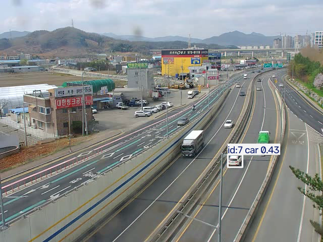

지점 11 전체 궤적 데이터(431대, 10만 레코드) 시각화 — 차로 형태가 뚜렷이 드러남:

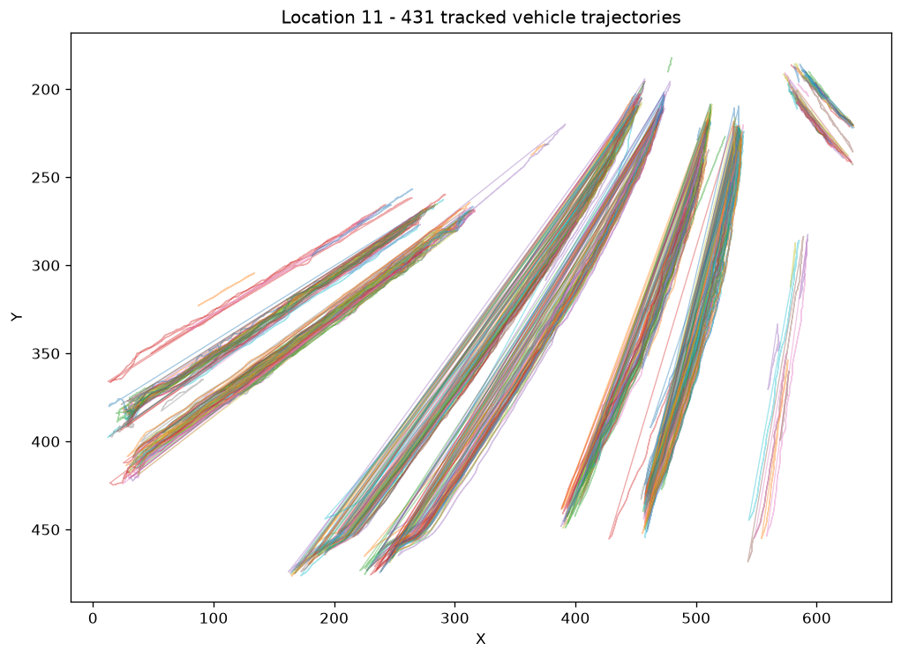

### 2. 차선 검출 — 궤적 히스토그램 기반

차선은 영상 화소가 아니라 **차량 궤적의 횡방향(X) 밀도 히스토그램**에서 추정한다.
특정 Y단면에서 X좌표 히스토그램(100 bins) → 가우시안 스무딩 → `find_peaks`로
피크 수 = 차선 수.

지점 11 결과: Y=50, 70 단면에서 각각 7개 피크 (실제 9차선 → 2개 과소 추정).
화면 원근으로 인해 상단(Y=20)에서는 차로가 병합되어 4개만 검출됨.

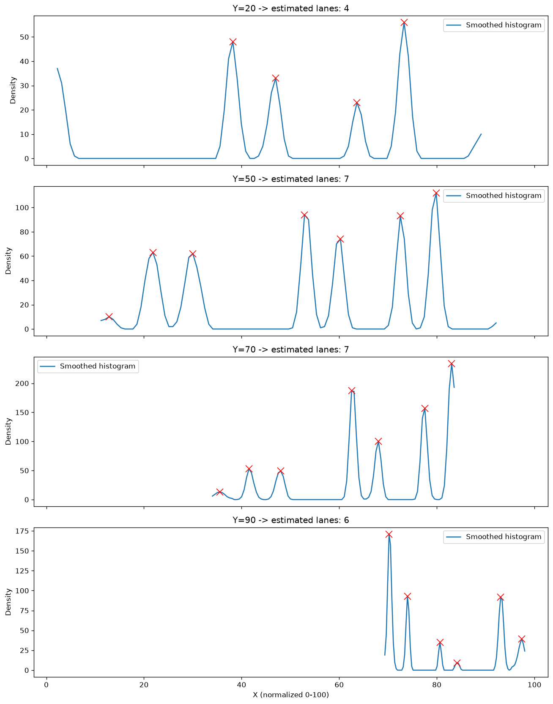

`lane_detection.py`(2D 히스토그램 횡방향 밀도 합산 방식)도 동일 데이터에서
7개 차선 위치와 진행 방향(라디안)을 정상 검출:

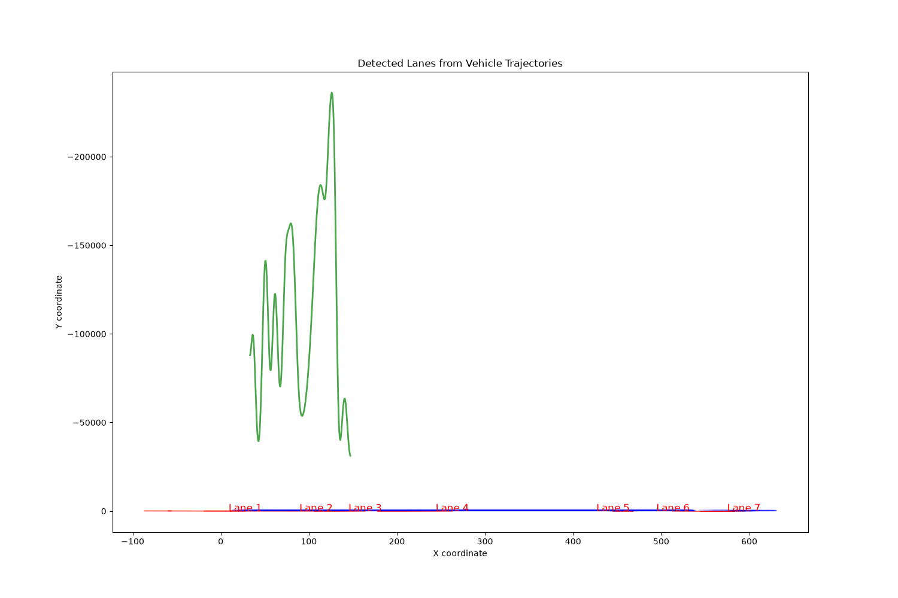

### 3. 전처리 — 시퀀스 생성

지점 11의 431개 궤적 중 10프레임 미만 5개를 제외한 426개가
상대좌표 변환 후 길이 50 시퀀스로 변환됨 (`(426, 50, 3)` — time, ΔX, ΔY).
전 지점 통합 데이터는 39개 지점, 383만 레코드.

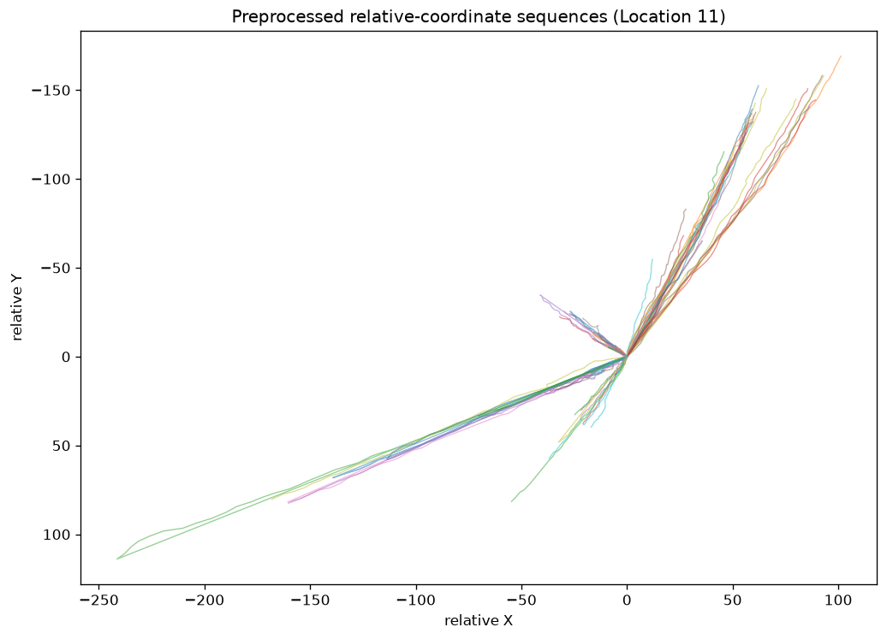

### 4. 지점 클러스터링

지점별 특성(차선 수, 평균속도, 통행량)을 표준화 후 군집화:

- **K-means (k=5)**: 실루엣 계수 **0.347**. 군집 1 = 대형/고통행 지점(11, 16, 24, 28, 31, 34, 39, 45, 48; 평균 8.9차선, 통행량 545대) 등 해석 가능한 군집 형성
- **DBSCAN (ε=1.2)**: 실루엣 0.15, 노이즈 지점 6개 분리 — 밀도 기반은 이 데이터에 부적합
- **GMM / 계층적 군집**: 군집 수 3~10 실험 정상 동작

→ 논문에서 K-means 채택 근거(실루엣 계수 우위)가 재현됨.

### 5. LSTM 오토인코더 — 이상궤적 식별

`train_full_model.py`와 동일한 구조(LSTM 64 인코더 → RepeatVector → LSTM 64 디코더,
시퀀스 50, 슬라이딩 윈도우 10)로 지점 3곳(11, 14, 17)의 27,934개 시퀀스를 10에폭 학습.

- 학습 정상 수렴: val loss 3.3e-4 → **8.6e-5**
- 궤적 단위 평균 재구성 오차 상위 5%(임계값 0.0033)를 이상궤적으로 판정 → 726개 궤적 중 **37개** 식별

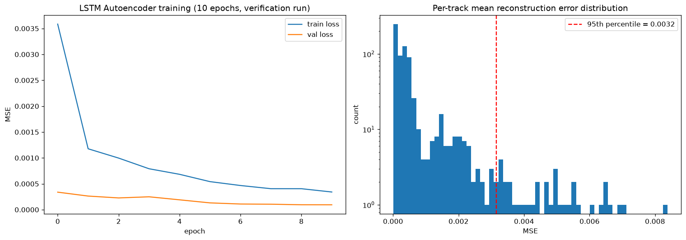

이상 판정 궤적(빨간색)은 차로를 가로지르거나 급격히 꺾이는 패턴을 보임:

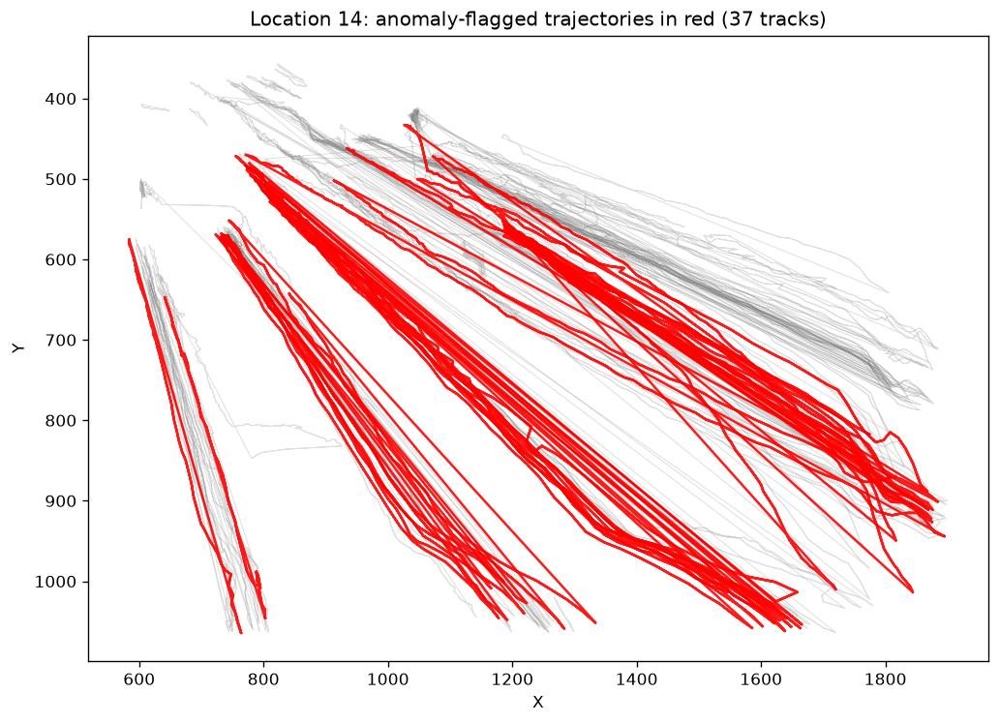

**주목할 점:** 통합(단일) 모델에서는 이상 판정 37건이 전부 지점 14에 집중됨.
단일 모델이 지점 간 좌표계·도로 형태 차이를 "이상"으로 오인하는 현상으로,
**지점을 클러스터링해 군집별 모델을 학습해야 정확도가 향상된다**는
논문의 핵심 주장을 뒷받침하는 결과.

### 6. 차선 수 추정 정확도 비교

`accuracy_comparison.py` — 실제 차선 수 대비 3가지 추정 방법 비교 (34개 지점):

| 방법 | 정확 일치 | ±1 이내 | MAE | RMSE |
|---|---|---|---|---|
| Original | 8.8% | 41.2% | 2.06 | 2.45 |
| Filtered | 23.5% | 41.2% | 1.91 | 2.44 |
| **New** | 17.6% | **55.9%** | **1.71** | **2.22** |

→ 개선된 방법(New)이 ±1 이내 일치율과 오차 지표에서 가장 우수.

## 개선 실험 ①: 지점별 정규화

단일(전역) MinMax 정규화의 문제를 확인하기 위해, **정규화만 지점별로 분리**하고
나머지 조건(지점 11·14·17, 시퀀스 50, 슬라이딩 윈도우 10, 10에폭, seed 42)은
동일하게 두고 재실험.

| | 전역 정규화 (기존) | 지점별 정규화 (개선) |
|---|---|---|
| 지점 11 이상 판정 | 0 / 384 | **8 / 384 (2.1%)** |
| 지점 14 이상 판정 | **37 / 171 (전량 쏠림)** | 29 / 171 (17.0%) |
| 지점 17 이상 판정 | 0 / 171 | 0 / 171 |

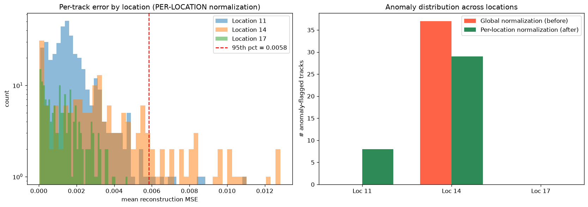

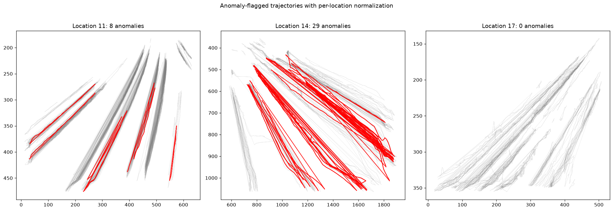

**해석:**

- 전역 정규화에서는 지점 14(프레임 폭 ~1900px)가 다른 지점(~640px)보다 좌표 범위가
  넓어, 정규화 후 지점 11·17 궤적이 좁은 구간에 압축됨 → 재구성이 쉬워지고 지점 14만
  오차가 커지는 **스케일 편향**이 발생. 이상 판정 37건 전량이 지점 14에 쏠린 원인.
- 지점별 정규화 후 지점 11에서도 이상궤적 8건이 정상적으로 검출되기 시작 —
  스케일 편향이 해소되어 "궤적 형태" 기반 판정으로 개선됨.
- 지점 14가 여전히 상대적으로 높은 비율(17%)인 것은 해당 지점의 도로 기하가 복잡하고
  차로 횡단 패턴이 실제로 많기 때문으로 보이나, **전역 95% 임계값을 지점별(또는
  군집별) 임계값으로 분리**하면 추가 개선 여지가 있음 — 논문의 군집별 모델 접근 및
  EVT 기반 동적 임계값과 연결되는 후속 과제.

## 개선 실험 ②: 지점별 임계값 분리

개선 실험 ①(지점별 정규화)과 동일한 모델에서, 이상 판정 임계값만
**전역 95% 분위수 → 지점별 95% 분위수**로 분리해 비교.

| 지점 | 전체 궤적 | 전역 임계값(0.0065) | 지점별 임계값 |
|---|---|---|---|
| 11 | 384 | 6 | **20** (thr 0.0048) |
| 14 | 171 | **31 (쏠림 잔존)** | 9 (thr 0.0105) |
| 17 | 171 | 0 | **9** (thr 0.0040) |

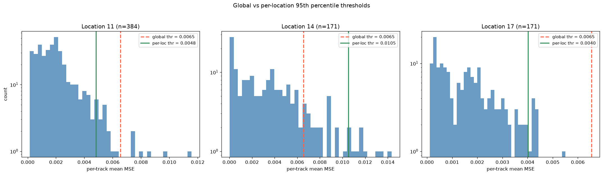

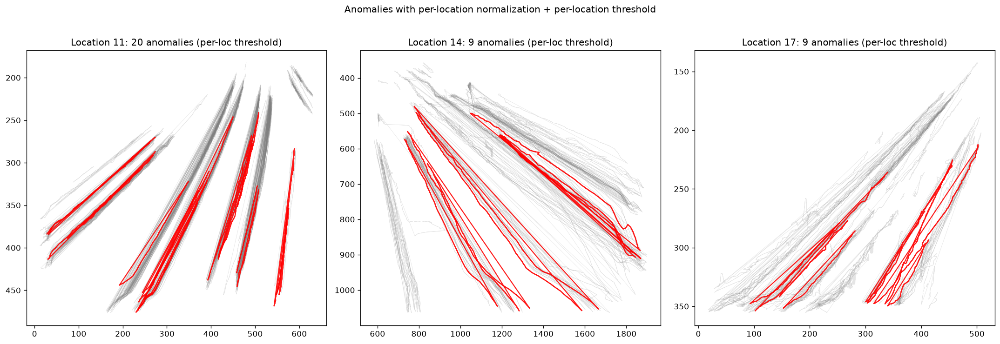

**해석:**

- 지점별 95% 임계값이 **2.6배 차이**(지점 17: 0.0040 vs 지점 14: 0.0105).
  오차 스케일 자체가 지점마다 다르다는 뜻으로, 단일 임계값으로는 오차가 큰 지점에
  판정이 쏠릴 수밖에 없음을 정량적으로 확인.
- 전역 임계값에서 이상궤적이 한 건도 안 나오던 **지점 17에서 9건이 새로 검출**됐고,
  시각화상 차로 묶음 사이를 가로지르는 궤적들로 질적으로 타당함.
- **주의(방법론적 한계):** 지점별 분위수 방식은 정의상 각 지점에서 상위 5%를
  이상으로 판정하므로 지점 간 균형은 "구조적으로 보장"되는 것. 실제 운영에서는
  ① 정상 데이터만으로 임계값을 보정(calibration set 분리)하거나
  ② 극단값 이론(EVT/POT)으로 꼬리 분포를 모델링해 지점별 임계값을 통계적으로
  산출하는 방식이 필요. 이 실험의 의의는 "임계값은 지점(군집) 단위로 산출해야 한다"는
  설계 원칙의 확인이며, 이는 논문의 군집별 모델 접근과 일관됨.

**개선 실험 ①+② 종합:** 전역 정규화·전역 임계값(기존)에서는 이상 판정이 특정 지점에
100% 쏠렸으나, 지점별 정규화 + 지점별 임계값 적용 후 세 지점 모두에서 형태 기반
이상궤적이 검출됨. 스케일 편향 제거 → 판정 기준 분리의 2단계 개선으로
"어느 지점에서든 동작하는" 이상궤적 식별 파이프라인에 근접.

## 검증 중 수정한 사항

- `4_clustering/dbscan.py`: `silhouette_score` import 누락으로 실행 중단되던 버그 수정
- `2_lane_detection/lane_count.py`: `plot_results()`가 전역변수 `file_name`에 의존하던 문제를 매개변수로 수정

## 알려진 제약

- 각 스크립트의 데이터 경로는 원 실험 환경(`D:/...`, `/home/cmyoon/...`) 기준으로 하드코딩되어 있어 로컬 환경에 맞게 수정 필요
- 원본 CCTV 영상·궤적 CSV·모델 가중치는 저장소에 포함되지 않음
