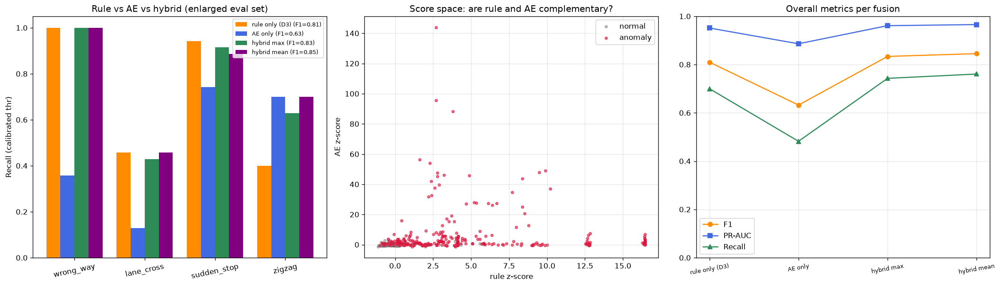

# 연구 여정 — CCTV 궤적에서 이상운행을 찾기까지

> 실험 ①~⑩이 어떤 생각의 흐름으로 이어졌는지를 시간 순서대로 풀어쓴 기록입니다.
> 수치와 상세 방법은 [ANALYSIS.md](ANALYSIS.md), 현재 상태는 [ROADMAP.md](ROADMAP.md) 참고.

---

## 0. 출발점 — 논문 코드는 진짜로 도는가

시작은 소박했다. 석사논문의 코드를 GitHub에 올리면서, 각 단계가 실제 데이터로
재현되는지 확인하고 싶었다. YOLOv8로 차량을 추적해 궤적을 뽑고, 궤적의 횡방향
밀도에서 차선을 읽어내고, LSTM 오토인코더가 정상 궤적을 학습한다 — 전부 돌았다.

지점 11의 궤적 43만 레코드를 겹쳐 그리면 도로가 저절로 드러난다. 차선 검출이
영상 화소가 아니라 **궤적의 통계**에서 나온다는 것이 이 연구의 출발 아이디어다.

그런데 검증 마지막에 이상한 것이 눈에 들어왔다. 통합 모델이 판정한 이상궤적
37건이 **전부 지점 14에 몰려 있었다.**

## 1. 첫 번째 실마리 — 이상탐지가 아니라 좌표계를 보고 있었다 (실험 ①②)

지점 14의 프레임 폭은 1900px, 다른 지점은 640px. 전역 MinMax 정규화를 거치면
작은 지점의 궤적은 좁은 구간에 압축되어 "재구성하기 쉬운" 데이터가 된다.
모델은 운전 행동이 아니라 **카메라 해상도**를 이상으로 판정하고 있었다.

정규화를 지점별로 분리하자(①) 쏠림이 풀렸고, 임계값도 지점별로 나누자(②)
한 건도 안 나오던 지점 17에서 이상궤적이 처음 검출됐다. 지점별 95% 임계값이
서로 2.6배나 달랐다 — 단일 기준으로는 애초에 성립하지 않는 문제였다.

## 2. 충격 — 그럴듯해 보이던 것의 실체 (실험 ③)

여기까지는 "상위 5%를 시각화하면 그럴듯한" 수준이었다. 그런데 그럴듯함은
증거가 아니다. 라벨이 없으니 만들기로 했다: 정상 궤적을 변형해 역주행·차로횡단·
급정거·지그재그 4유형의 합성 이상을 주입하고, 처음으로 F1을 측정했다.

**F1 0.25.** 역주행은 위치 좌표만으로는 원리적으로 구분 불가(시간 역순 궤적의
형태는 정상과 동일), 급정거는 정체 궤적에 묻히고, 지그재그는 오토인코더가
"너무 잘" 재구성해버렸다(과잉일반화).

뼈아팠지만 이 순간이 연구의 진짜 시작이었다. 이후 모든 실험은 이 평가셋
위에서 판정된다.

## 3. 최대 도약 — 도로를 아는 특징 (실험 ④)

모델이 못 하면 특징이 해야 한다. 학습 궤적만으로 도로 모델을 세웠다:
통행 방향별로 분리한 차선 중심, 그리고 화면을 48×48 격자로 나눠 셀마다
기대 진행방향을 담은 **2D 방향장(direction field)**.

궤적 단위 규칙 점수 4개(방향장 대비 역주행 정렬도, 최대 차선 이탈, 오프셋
변동성, 정지 비율)의 z-score 최댓값으로 판정을 바꾸자 —
**F1 0.25 → 0.65, 역주행 22 → 89%, 급정거 100%.**

교훈: 판별적 특징을 오토인코더에 넣어도 재구성 오차는 커지지 않는다.
도메인 지식은 특징과 규칙으로 직접 쓰는 것이 빨랐다.

## 4. 원근이라는 유혹 — 세 번의 실패 (실험 ⑤⑥⑦)

남은 병목은 차로횡단과 지그재그. "CCTV의 원근 왜곡 때문에 횡방향 신호가
찌그러진다"는 가설은 너무나 그럴듯했다. 그래서 소실점을 자동 추정해 차로를
평행화했다(⑤). 결과는 순손실 — 보정이 원거리를 확대하면서 **추적 지터까지
같이 확대**했다.

지터가 문제라면 지우면 되지 않나? 스무딩 → 원거리 절단+완전 보정 → 국소 분산
정규화를 누적 적용해봤다(⑥). 스무딩만 살아남았다.

박스 중심이 문제인가? 호모그래피는 도로 평면 위의 점에만 유효한데 박스 중심은
차량 높이만큼 떠 있다. 원본 영상 전체를 YOLOv8x로 재처리해 **바퀴 접지점(하단
중앙점)** 좌표를 새로 뽑고, 같은 추적 실행에서 좌표만 다른 짝비교를 했다(⑦).
하단 중앙점 + 스무딩은 채택(구성 A2, F1 0.70)됐지만 — 물리적으로 올바른
입력으로도 자동 보정은 여전히 손해였다. 3전 3패. 자동 원근 보정은 여기서 접었다.

## 5. 실측이라면 다를까 — 그리고 반전 (실험 ⑧⑨)

"자동 추정이 부정확해서 진 것"이라는 반론이 남아 있었다. 그래서 위성사진과
CCTV 배경(60프레임 중앙값으로 차량을 지운 프레임)을 나란히 놓고 대응점을
클릭하는 도구를 만들어, 지점 11·14의 실측 호모그래피를 얻었다. 잔차 0.4~0.7m.
차선 간격으로 스케일까지 고정하니 **속도가 드디어 km/h로 읽혔고**(지점 14 최고
67km/h — 제한속도 50 도로에서 그럴듯한 값), 궤적이 위성사진 위에 정확히 얹혔다.

탐지율도 올라 보였다. F1 0.70 → 0.73. 드디어 보정이 이겼다고 기록까지 했다.

그런데 곡선 도로(지점 11) 대응을 위해 곡선 중심선 좌표계를 실험(⑨)하다가,
결과가 실행마다 요동치는 것을 보고 멈췄다. 원인을 따져보니 **평가셋이 지점·
유형당 6개** — 탐지율의 최소 눈금이 17%p였다. 한 개 차이가 "개선"으로 보이는
구조였던 것이다. 지점·유형당 24개로 확대해 다시 재보니:

실측 호모그래피의 "개선"은 재현되지 않았다 (이미지 좌표 F1 0.74 vs 미터 평면
0.67). ⑧의 주장은 문서에 정정 주석을 달아 철회했다. 곡선 중심선도 기각.
얻은 것은 두 가지 — ① 이미지 좌표의 원근 압축은 잡음 많은 원거리를 자연스럽게
축소하는 **암묵적 정규화**였다는 이해, ② **평가셋 크기가 판정을 좌우한다**는,
이 시리즈에서 가장 비싼 교훈.

## 6. 문제를 다시 읽다 — cross_flow (실험 ⑩)

확대 평가셋이 가리킨 진짜 병목은 차로횡단 11%. 이유를 코드에서 다시 읽었다.
오프셋 특징은 "**가장 가까운** 차선 중심까지의 거리"다. 세 차로를 가로질러도
새 차선에 정착하는 순간 오프셋은 도로 0이 된다. 신호가 접혀서(fold) 사라진다.

순진한 해법 — 시작과 끝의 횡위치 차이 — 는 즉시 실패했다. 정상 궤적조차 직선
축 기준으로는 5.4차로를 "이동"한다. 곡선과 원근의 기하 드리프트다. ⑨에서
곡선 중심선(좌표계 교체)으로 풀려다 실패한 바로 그 문제가 다시 나타났다.

이번에는 좌표계를 바꾸는 대신 특징의 기준을 바꿨다. 실험 ④부터 있던 2D
방향장에 **수직인 변위 성분만 부호 있게 누적**하는 특징, `cross_flow`.
방향장이 곡선 기하를 이미 담고 있으므로, 차선을 따라가면 0이고 가로지르면
건넌 차로 수만큼 쌓인다. 분포가 갈라졌다: 정상 중앙값 0.21차로, 차로횡단 1.78차로.

**차로횡단 11 → 47%, F1 0.74 → 0.81, 오탐은 오히려 감소.** 실험 ④ 이후 최대
도약이 ④가 만들어둔 구조(방향장) 위에서 나왔다. 곡률 문제의 답은 더 좋은
좌표계가 아니라, 기하를 이미 알고 있는 구조에 대해 특징을 정의하는 것이었다.

## 7. 버렸던 모델을 다시 부르다 — 하이브리드 (실험 ⑪)

실험 ④에서 규칙 점수가 LSTM-AE를 크게 이긴 뒤, 오토인코더는 사실상 벤치에
앉아 있었다. 그런데 확대 평가셋의 유형별 성적표를 다시 보니 묘한 구석이 있었다
— 규칙이 약한 곳(지그재그 40%)이 하필 재구성 오차가 민감할 법한 고주파 패턴이다.

둘 다 지점별 z-score로 정규화해 나란히 놓고 재봤다. 프로필이 정확히 반대였다:
규칙은 역주행 100%·지그재그 40%, AE는 역주행 36%·지그재그 70%. 규칙이 놓친
이상 84개 중 38개를 AE가 잡았다. 두 z-score의 평균으로 결합하자 —

**F1 0.81 → 0.85, 지그재그 40 → 70%.** 추가 오탐은 정상 150개 중 3개.
④의 결론은 "규칙이 AE를 이긴다"가 아니라 **"규칙이 주도하고 AE가 보완한다"**로
정밀화됐다. 버린 줄 알았던 모델의 자리는 대체가 아니라 보완이었다.

## 8. 지금까지의 답, 그리고 남은 것

최종 구성: **이미지 좌표 + 하단 중앙점 + Savitzky-Golay 스무딩 + 직선 차선 모델
+ 6특징 규칙 점수 + LSTM-AE 하이브리드 mean** (확대 평가셋 F1 0.85 / PR-AUC 0.97).
복잡한 기하 보정은 전부 기각됐고, 살아남은 것은 좋은 입력(⑦), 좋은 특징(④⑩),
지점별 기준(①②), 상보적 결합(⑪), 그리고 믿을 수 있는 평가(③⑨)였다.

| 교훈 | 나온 실험 |
|---|---|
| 모델이 이상을 배우기 전에, 좌표계 편향부터 의심하라 | ①② |
| 그럴듯한 시각화는 증거가 아니다 — 라벨을 만들어 재라 | ③ |
| 도메인 지식은 특징·규칙으로 직접 쓰는 게 빠르다 (AE 과잉일반화) | ④ |
| 기하 보정은 잡음도 함께 보정한다(확대한다) | ⑤⑥⑦⑧ |
| 평가셋 크기가 판정을 좌우한다 — 양자 크기를 계산하라 | ⑨ |
| 접히는(fold) 특징을 의심하고, 기하는 방향장에 맡겨라 | ⑩ |
| 진 모델도 버리지 말라 — 약점이 반대라면 결합하라 | ⑪ |

남은 것: 저진폭 차로횡단은 정상 차선변경과 형태가 같아 원리적으로 어렵다
(46%에서 정체). 합성이 아닌 **실제 이상 사례 라벨링**으로 이 수치의 실체를
확인하는 것, 그리고 39개 전 지점으로의 확장이 다음 장이다.
